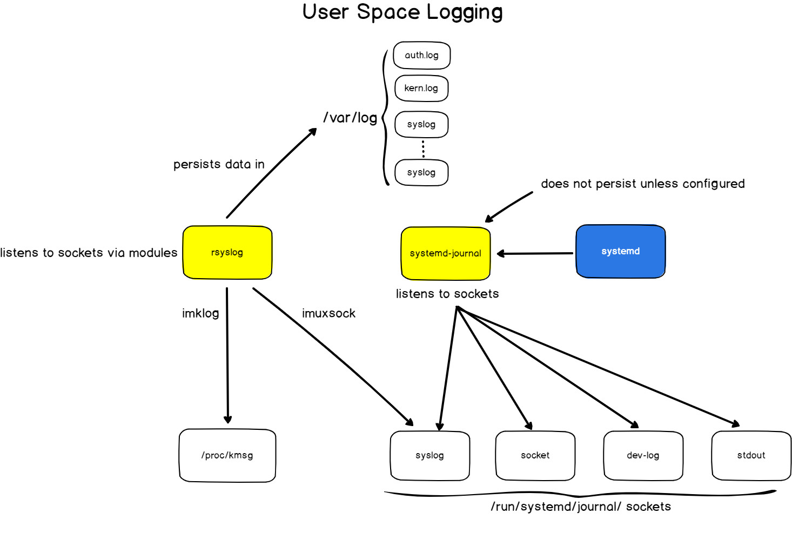
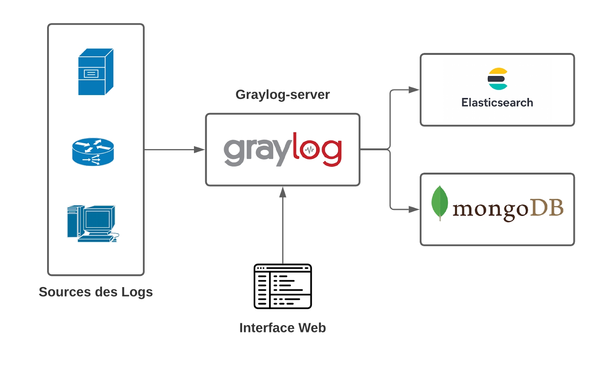
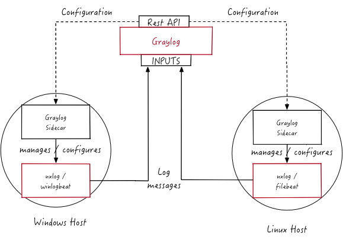

# TP Gestion des Logs
Au cours de ce TP, vous explorerez et implémenterez la gestion des logs sur des machines Linux et Windows.
Vous commencerez par préparer l'infrastructure, puis vous manipulerez et configurerez les logs sur les machines Linux et Windows.
Vous finirez par installer et configurer les trois solutions de centralisation de logs vues en cours: **Elastic Stack**, **Graylog** et **Grafana Loki**. 

## Rendu
**Attention!** Afin d'être évalué, vous devez rédiger un rapport dans lequel vous mettez les commandes exécutées sur les machines, les fichiers de configuration créés et les réponses aux questions posées. N'hésitez pas à inclure des captures d'écran pour étayer vos réponses.

## Préparation de l’infrastructure
Dans cette section, vous devez créer 5 machines virtuelles dans OpenStack.

Ces machines doivent avoir les noms d'hôte et les caractéristiques suivants :
- `[num]-nginx-server` (Ubuntu Server 22.04.3, 2vCPU, 4GB RAM, 10GB d’espace disque)
- `[num]-graylog` (Ubuntu Server 22.04.3, 4vCPU, 16GB RAM, 20GB d’espace disque)
- `[num]-elastic` (Ubuntu Server 22.04.3, 4vCPU, 16GB RAM, 20GB d’espace disque)
- `[num]-loki` (**Ubuntu Server 22.04.3 - Docker Ready**, 2vCPU, 4GB RAM, 10GB d’espace disque)
- `[num]-windows-web-server` (Windows 10, 2vCPU, 8GB RAM, 50GB d’espace disque) (BONUS)
  - Pour la machine Windows, créez un volume séparé avec 50 Go de stockage et l'image Windows 10 comme source de volume.
  - Ensuite, créez l'instance Windows avec le volume créé précédemment comme source de démarrage.

Où `[num]` est votre numéro d'étudiant ou votre numero de groupe.

## Logs Linux
Dans cette section, vous manipulerez les logs Linux. 

Vous allez visualiser, configurer et générer les logs sur la machine `nginx-server`.

Pour commencer, vous devez installer un serveur `nginx` via le gestionnaire de packages `apt`. 
Vérifiez si le port `80` est bien ouvert dans `OpenStack` et testez si le serveur `nginx` répond bien aux requêtes des utilisateurs.

### Rappel: Architecture des logs de l'espace utilisateur Linux



### Rsyslog
`Rsyslog` est une implémentation du protocole `syslog` et est fourni par défaut sur la plupart des systèmes Linux modernes. 
`Syslog` est utilisé comme standard pour produire, transmettre et collecter des logs.

`Rsyslog` récupère les logs de l’espace noyau et du journal de systemd et les enregistre dans des fichiers.

Analysez les fichiers de configuration de `rsyslog` (`/etc/rsyslog.conf` et les fichiers dans `/etc/rsyslog.d/`). 
- Quels modules sont activés par défaut et que font-ils?
- Comment les filtres sont-ils définis dans les fichiers de configuration et à quoi servent-ils ? Que signifie le filtre `*.*`?
- Quelles logs sont écrites dans le fichier `/var/log/syslog`?
- Dans quel fichier sont écrits les logs du noyau?

Configurez `rsyslog` pour qu’il envoie tous les logs contenant le mot `ssh` dans le fichier `/var/log/ssh.log`. (Créez un fichier de configuration dans `/etc/rsyslog.d/`, n’oubliez pas de redémarrer le `rsyslog`).
- Que mettez-vous dans le fichier de configuration?

Vérifiez si le fichier `/var/log/ssh.log` existe et contient des entrées avec le mot `ssh`.

### Systemd Journal
Le `systemd` est un gestionnaire de systèmes et de services qui implémente son propre service de journalisation appelé `systemd-journald` (`journald`). 
Les services `systemd` envoient les logs directement au `journald`. 
Les fichiers logs du `journald` sont stockés par défaut dans `/var/log/journal`. 

Essayez de visualiser les fichiers logs `journald` avec la commande `cat`.
- Les logs sont-ils lisibles? Expliquez le résultat.
- Quelle commande permet d'afficher les logs `journald`?
- Quelle commande permet de visualiser les logs enregistrés au cours de la dernière heure?
- Quel est l’avantage de stocker des logs de cette manière?

### Generation des logs
Dans cette section, vous allez générer des logs avec la ligne de commande.

#### Logs noyau
Envoyez le log contenant la phrase `Hello world` à l’espace de logs du noyau et visualisez-la via la commande `dmesg` (Pour ce faire, vous pouvez écrire le log en tant qu'utilisateur root dans `/dev/kmsg`). 
- Quelle commande utiliserez-vous pour faire cela?

Vérifiez si le log a été bien écrit dans le fichier `/var/log/syslog` par `rsyslog` en tant que log du noyau.
- Quel module `rsyslog` est responsable de la récupération des logs de l'espace noyau afin de les écrire dans ce fichier ?

#### Logs espace utilisateur
Envoyez le log contenant la phrase `Hello world` au journal de `systemd` (Pour ce faire, vous pouvez utiliser la commande `systemd-cat`). 
- Quelle commande utiliserez-vous pour faire cela?

Vérifiez si le log a été bien enregistré avec la commande `journalctl` et vérifiez que `rsyslog` a bien écrit ce log dans le fichier `/var/log/syslog`.
- Quel module `rsyslog` est responsable de la récupération des logs du journal `systemd` afin de les écrire dans ce fichier?

### Suppression des logs
Sur les systèmes Linux, vous pouvez facilement supprimer les logs.

Pour supprimer les logs écrits dans des fichiers avec `rsyslog`, il suffit de purger, supprimer ou éditer le fichier.

Supprimez tous les logs du fichier `/var/log/syslog`. (***Attention!*** Ne supprimez pas le fichier lui-même!)
- Quelle commande utiliserez-vous pour faire cela?

Vérifiez que les anciens logs ont été bien supprimés et que les nouveaux logs continuent d'être écrits dans le fichier `/var/log/syslog`.

Pour supprimer les logs du journal `systemd`, il suffit d’utiliser les options `--rotate` et `--vacuum-time` de la commande `journalctl`. 

Supprimez tous les logs du journal `systemd`.
- Quelle commande utiliserez-vous pour faire cela?

Vérifiez que les anciens logs ont été bin supprimés.

### Logrotate
`Logrotate` est un outil système qui gère la rotation, la compression et la suppression automatique des fichiers log. 
Sans ces mécanismes, les logs pourraient éventuellement consommer tout l'espace disque disponible sur un système et le rendre inutilisable.

Visualisez le fichier de configuration de `logrotate` et trouvez la configuration de rotation des logs pour le fichier `/var/log/syslog`. 
- Comment fonctionne la rotation des logs pour le fichier `/var/log/syslog` (fréquence de rotation, durée de rétention, compression)?

Configurez la rotation pour le fichier `/var/log/ssh.log`. 
La rotation doit avoir lieu tous les jours, les 7 derniers fichiers doivent être conservés, la compression doit être activée.
- Que mettez-vous dans le fichier de configuration?

Vérifiez si votre configuration est correcte et est prise en compte avec la commande `sudo logrotate /etc/logrotate.conf --debug`. 
- Que renvoie cette commande ? Comment avez-vous pu vérifier que votre configuration était bien prise en compte ?

Trouvez un moyen de forcer la rotation pour le fichier `/var/log/ssh.log` avec `logrotate` et vérifiez que la rotation a été bien effectuée.
- Quelle commande utiliserez-vous pour faire cela?
- Que pouvez-vous remarquer ? Le fichier `/var/log/ssh.log` a-t-il été compressé ?

Generez des logs contenant le mot `ssh` et exécutez à nouveau le `logrotate` forcé. 
- Que pouvez-vous remarquer ? Expliquez le résultat.

### Fail2ban
Dans cette section, vous allez installer et configurer l’outil `fail2ban`. 
Cet outil analyse les fichiers logs et interdit les adresses IP qui montrent des signes de comportement malveillant. 

Installez l’outil `fail2ban` via le gestionnaire des packages `apt`.

#### Les filtres
`Fail2ban` est fourni par défaut avec plusieurs filtres.
Les filtres sont généralement des expressions régulières utilisées pour détecter les tentatives d'effraction, les échecs de mot de passe, etc. 

Les filtres sont stockés dans `/etc/fail2ban/filter.d`. 

#### Les actions
Une action définit une ou plusieurs commandes qui sont exécutées à différents moments: lors du démarrage/arrêt d'un jail, de l'interdiction/suppression d'un hôte, etc.

Les actions sont stockés dans `/etc/fail2ban/action.d`.

#### Les jails
Un jail est une combinaison d'un filtre et d'une ou plusieurs actions. 

Les configurations des jails sont stockés dans `/etc/fail2ban/jail.d`.
- Quel jail est activé par défaut?

Confirmez que le jail est bien activé en utilisant le client fail2ban `fail2ban-client`. 
- Quelle commande utiliserez-vous pour faire cela?

Demandez à l'un de vos collègues de tenter plusieurs fois de se connecter à la machine `nginx` avec un mot de passe erroné ou un utilisateur inexistant via SSH jusqu'à ce qu'il soit bloqué par `fail2ban`.  
- Après combien de tentatives de connexion échouées `fail2ban` a-t-il bloqué l'accès? 

Visualisez les iptables avec la commande `iptables -L`.
- Quelle règle a été créé par `fail2ban`?

Visualisez l'état du jail `sshd` avec le client `fail2ban` `fail2ban-client`. 
- Quelle commande utiliserez-vous pour faire cela?

Supprimez l’adresse IP de votre collègue de jail avec le client `fail2ban`.
- Quelle commande utiliserez-vous pour faire cela?

## Logs Windows - BONUS
Dans cette section, vous allez visualiser et manipuler les logs Windows sur la machine `windows-web-server`.

Pour vous connecter à la machine Windows via RDP, vous pouvez utiliser l'outil `Remmina`.
L'utilisateur et le mot de passe par défaut dans l'image `Windows 10` disponible sur Openstack sont `etuinfo`.

`Windows Event Logs` contient les logs du système d'exploitation et des applications. 
Les logs utilisent un format de données structuré, ce qui facilite la recherche et l’analyse des logs.

Utilisez `Windows Event Viewer` afin de visualiser les logs Windows.
- Quelles catégories de logs sont disponibles dans Event Viewer? 
- Quels logs chaque catégorie contient-elle?
- Dans quel dossier les Event Logs sont-ils stockées?
- Est-il possible de supprimer une seule entrée des logs Windows?

Créez un `Custom View` avec les logs de démarrage du noyau (provenant de la source `Kernel-Boot`).
- Qu'est-ce que les `Custom Views` vous permettent de faire?

Sauvegardez et effacez les logs de sécurité, puis ouvrez le fichier sauvegardé avec `Windows Event Viewer`.
- Quel log de sécurité est créé lorsque vous effacez les logs?
- Sous quelle catégorie le fichier de logs ouvert apparaît-il?

## Centralisation des logs
Dans cette section, vous allez planifier et configurer la centralisation des logs de toutes les machines en utilisant les 3 solutions de centralisation des logs vues en cours.
- Pourquoi est-il important de centraliser les logs?

### Planification de collecte des logs
Comme dans le cadre de ce TP le volume de logs ne sera pas important, vous allez choisir la stratégie de collecte de logs semi-maximaliste.

**Pour les machines Linux**, vous allez collecter et envoyer les logs `syslog`, les logs d'authentification et les logs du serveur `nginx`.

**Pour la machine Windows**, vous allez collecter et envoyer tous les `Event Logs`.

- Dans un environnement de production avec une très grande quantité de logs, cette stratégie est-elle viable ?

Pour collecter et envoyer les logs des machines, vous allez utiliser un agent. 

- Dans quel cas l’utilisation d’un agent n’est-elle pas possible?

Pour faciliter le travail dans le cadre de ce TP, vous n'allez pas configurer d'authentification ou de canaux sécurisés pour transférer les logs. 
En revanche, c’est obligatoire en production, car les logs peuvent contenir des informations sensibles.

### Elastic Stack
`Elastic Stack` est une solution de monitoring et de gestion des logs très populaire. 
Cette solution permet de récupérer de manière fiable et sécurisée des données depuis n'importe quelle source, dans n'importe quel format, puis de les rechercher, les analyser et les visualiser en temps réel. 
Dans le cadre de ce TP, nous limitons son utilisation à la centralisation et à l'agrégation de logs.

Dans cette partie, vous allez donc déployer et configurer un `Elastic Stack` pour la centralisation et l'agrégation des logs.

#### Architecture de Elastic Stack


#### Installation
Dans cette section, vous allez installer `Elasticsearch`, `Kibana` et `Logstash` sur la machine `elastic` et un agent collecteur `Beats` (`Filebeat` ou `Winlogbeat`) sur chaque machine précédemment créée.

##### Installation de l’Elasticsearch
`Elasticsearch` est un moteur de recherche, de stockage et d'analyse distribué basé sur Apache Lucene, qui prend en charge de très gros volumes de données.

Installez `Elasticsearch` avec les commandes suivantes
```
$ wget -qO - https://artifacts.elastic.co/GPG-KEY-elasticsearch | sudo gpg --dearmor -o /usr/share/keyrings/elasticsearch-keyring.gpg
$ echo "deb [signed-by=/usr/share/keyrings/elasticsearch-keyring.gpg] https://artifacts.elastic.co/packages/8.x/apt stable main" | sudo tee /etc/apt/sources.list.d/elastic-8.x.list
$ sudo apt update
$ sudo apt install elasticsearch
```
**Attention!** Lors de l'installation, `elasticsearch` génère un mot de passe pour le superutilisateur `elastic`. Enregistrez ce mot de passe car vous en aurez besoin plus tard!

Démarrez Elasticsearch et activez le démarrage automatique au démarrage du système.
```
$ sudo systemctl daemon-reload
$ sudo systemctl start elasticsearch
$ sudo systemctl enable elasticsearch
```

Vérifiez avec les commandes `systemctl` et `journalctl` que `elasticsearch` a démarré sans erreur.
- Quelles commandes utiliserez-vous pour faire cela?

Ensuite, vérifiez que Elasticsearch fonctionne et repond aux requêtes en envoyant une requête HTTP `GET` à l'API REST d'Elasticsearch avec la commande `curl` sur le port `9200`.
```
$ sudo curl --cacert /etc/elasticsearch/certs/http_ca.crt -u elastic https://localhost:9200
```
- Quel est le résultat de la commande `curl`?

##### Installation et configuration de Kibana
`Kibana` est une interface Web qui permet de visualiser et d’analyser les données stockées dans `Elasticsearch`.

Installez, démarrez `Kibana` et activez le démarrage automatique au démarrage du système.
```
$ sudo apt install kibana
$ sudo systemctl start kibana
$ sudo systemctl enable kibana
```

Vérifiez avec les commandes `systemctl` et `journalctl` que `kibana` a démarré sans erreur.
- Quelles commandes utiliserez-vous pour faire cela?

Puisque `Kibana` est configuré par défaut pour écouter uniquement sur `localhost`, pour pouvoir y accéder, vous devez le configurer pour écouter sur l'adresse IP de la machine `elastic`. 

Vous allez également changer le port de Kibana en `8080`, afin de pouvoir y accéder via le VPN.

Pour ce faire, décommentez `server.port` et `server.host` dans le fichier de configuration `/etc/kibana/kibana.yml` et mettez-y le port `8080` et l'adresse IP de la machine `elastic`.

Redémarrez le service `kibana`.

Vérifiez que le port `8080` de la machine `elastic` est bien ouvert dans `Openstack`.

Accédez à `Kibana` via votre navigateur Web en utilisant l’adresse IP de la machine `elastic` et le port `8080`.

Kibana vous demandera un enrollment token qui peut être généré en exécutant sur la machine `elastic` la commande
```bash
$ sudo /usr/share/elasticsearch/bin/elasticsearch-create-enrollment-token -s kibana
```

Générez le enrollment token, fournissez-le à `Kibana`. 

Le code de vérification sera disponible dans les logs du service `kibana`. 
Vous pouvez le récupérer via `journalctl`.

Authentifiez-vous avec l'utilisateur `elastic` et le mot de passe généré lors de l'installation de `elasticsearch`.

Visualisez la page `http://IP_ADDR_MACHINE_ELASTIC:8080/status` pour vérifier que Kibana fonctionne correctement.
- Avez-vous réussi à faire fonctionner Kibana ?

##### Installation et configuration de Logstash
`Logstash` est un agrégateur qui collecte des données provenant de diverses sources d'entrée, effectue différentes transformations, puis les envoie à une destination. 

Dans le cadre de ce TP, `Logstash` va envoyer les données à `Elasticsearch`.

Installez le `Logstash` sur la machine `elastic`.
```
$ sudo apt install logstash
```

`Logstash` peut également être vu comme un pipeline qui prend des données à une extrémité, les traite d'une manière ou d'une autre et les envoie à une destination.

Un pipeline `Logstash` comporte deux éléments obligatoires, ***une entrée*** et ***une sortie***, et un élément facultatif, ***un filtre***. 

Pour configurer ce pipeline, vous devez créer deux fichiers de configuration. 
Un fichier pour configurer une entrée et l’autre fichier pour configurer une sortie.

Créez le fichier de configuration de l'entrée `/etc/logstash/conf.d/01-beats-input.conf`
```conf
input {
  beats {
    port => 5044
  }
}
```

Avec cette configuration, `Logstash` écoutera le port `5044` et attendra les données au format `Beats`. 
<!---
Vérifiez que le port `5044` de la machine `elastic` est bien ouvert dans `Openstack`.
--->

Créez le fichier de configuration de la sortie
`/etc/logstash/conf.d/02-elasticsearch-output.conf`
```conf
output {
  if [@metadata][pipeline] {
    elasticsearch {
      hosts => ["localhost:9200"]
      user => elastic
      password => "MOT_DE_PASSE"
      cacert => "/etc/elasticsearch/certs/http_ca.crt"
      ssl => true
      manage_template => false
      index => "%{[@metadata][beat]}-%{[@metadata][version]}-%{+YYYY.MM.dd}"
      pipeline => "%{[@metadata][pipeline]}"
    }
  } else {
    elasticsearch {
      hosts => ["localhost:9200"]
      user => elastic
      password => "MOT_DE_PASSE"
      cacert => "/etc/elasticsearch/certs/http_ca.crt"
      ssl => true
      manage_template => false
      index => "%{[@metadata][beat]}-%{[@metadata][version]}-%{+YYYY.MM.dd}"
    }
  }
}
```
- Vous devez remplacer le `MOT_DE_PASSE` par le mot de passe généré lors de l'installation `elasticsearch`.
- Pour que `logstash` ait accès au certificat `/etc/elasticsearch/certs/http_ca.crt`, vous devez ajouter l'utilisateur `logstash` dans le groupe `elasticsearch` avec la commande.
```bash
$ sudo usermod -a -G elasticsearch logstash
```

Avec cette configuration, `Logstash` enverra des logs directement à `Elasticsearch`. 

Les logs seront stockes dans l'index nommé selon le Beat utilisé et postfixé par la date.

Démarrez le `logstash` et activez le démarrage automatique
```
$ sudo systemctl start logstash
$ sudo systemctl enable logstash
```

Vérifiez avec les commandes `systemctl` et `journalctl` que `logstash` a démarré sans erreur.
- Quelles commandes utiliserez-vous pour faire cela?

##### Configuration des agents collecteurs sous Linux
Dans cette section, vous allez utiliser `Filebeat` comme agent collecteur de logs. 

Cet agent doit être installe et configuré sur toutes les machines créées au cours de ce TP. 

Vous allez commencer par la machine `elastic`, car sur cette machine vous devrez effectuer des actions supplémentaires.

Sur toutes les machines **sauf `elastic`** vous devez ajouter les repos `Elastic` dans le gestionnaire des packages `apt`.
```
$ wget -qO - https://artifacts.elastic.co/GPG-KEY-elasticsearch | sudo gpg --dearmor -o /usr/share/keyrings/elasticsearch-keyring.gpg
$ echo "deb [signed-by=/usr/share/keyrings/elasticsearch-keyring.gpg] https://artifacts.elastic.co/packages/8.x/apt stable main" | sudo tee /etc/apt/sources.list.d/elastic-8.x.list
$ sudo apt update
```

Installez le `Filebeat`
```
$ sudo apt install filebeat
```

Par défaut, `Filebeat` essaye d’envoyer les logs directement à `Elasticsearch`. 

Dans notre cas, vous allez configurer `Filebeat` pour qu'il envoye les logs à `Logstash`. 

Pour ce faire, vous allez modifier le fichier de configuration de `Filebeat`. 

Dans le fichier `/etc/filebeat/filebeat.yml` commentez la section `output.elasticseach`.
```
#output.elasticsearch:
 # Array of hosts to connect to.
 #  hosts: ["localhost:9200"]
```

Ensuite decommentez la section `output.logstash` et configurez l’envoie des logs à `Logstash`
```
output.logstash:
 # The Logstash hosts
 hosts: ["ADRESSE_IP_DE_LA_MACHINE_ELASTIC:5044"]
```

Jusqu'à présent, vous avez configuré la sortie des logs, tous les logs collectés seront envoyés à `Logstash`.
Vous devez maintenant indiquer à `Filebeat` quels logs il doit collecter.

Pour ce faire, vous avez deux options: 
- Modifier manuellement le fichier de configuration `Filebeat` et spécifier les fichiers logs à surveiller.
- Utiliser les modules fournis avec `Filebeat`. 
  - `Filebeat` est livré avec plusieurs modules vous permettant de specifier les sources des logs.

Dans cette section, vous allez utiliser deux modules `Filebeat` pour specifier les logs à collecter :
- Le module `system` qui configure la collecte de logs `syslog` (`/var/log/syslog`) et de logs d'authentification (`/var/log/auth.log`).
- Le module `nginx` qui configure la collecte de logs d'accès et de logs d'erreurs du serveur nginx.

Vous pouvez activez le module `system` avec la commande:
```
$ sudo filebeat modules enable system
```

Vous pouvez voir une liste des modules disponibles, activés et désactivés en exécutant la commande:
```
$ sudo filebeat modules list
```

Après avoir activé le module `system`, vous devez spécifier dans le fichier de configuration du module `/etc/filebeat/modules.d/system.yml` quels logs collecter. 
- Modifiez le fichier de configuration afin que le module collecte les logs syslog et les logs d'autorisation.
- Donnez le contenu du fichier de configuration du module `system`.

Activez le module `nginx` sur les machines avec un serveur `nginx`. 
N'oubliez pas de modifier le fichier de configuration du module afin qu'il collecte les logs d'accès et les logs d'erreurs du serveur nginx.
- Quelle commande utiliserez-vous pour faire cela?
- Donnez le contenu du fichier de configuration du module `nginx`.

Une fois que `Filebeat` connaît quels logs à collecter et où les envoyer, il est nécessaire de créer le template d'index pour stocker les logs `Filebeat` dans `Elasticsearch` et une description des pipelines de traitement des logs. 

Pour rappel, un index `Elasticsearch` est un ensemble de documents présentant des caractéristiques similaires.
Les index sont identifiés par leur nom. 
Le template d'index sera automatiquement appliqué lors de la création d'un nouvel index.

Pour créer des template d'index et des pipelines de traitement, exécutez les commandes suivantes **sur la machine `elastic`** :
```
$ ELASTIC_PASSWORD="MOT_DE_PASSE"
$ sudo filebeat setup --index-management -E output.elasticsearch.password="$ELASTIC_PASSWORD" -E output.elasticsearch.username=elastic -E 'output.elasticsearch.ssl.certificate_authorities="/etc/elasticsearch/certs/http_ca.crt"' -E 'output.elasticsearch.hosts=["https://localhost:9200"]' -E 'output.logstash.enabled=false'
$ sudo filebeat setup --pipelines --modules system,nginx --force-enable-module-filesets -E output.elasticsearch.password="$ELASTIC_PASSWORD" -E output.elasticsearch.username=elastic -E 'output.elasticsearch.ssl.certificate_authorities="/etc/elasticsearch/certs/http_ca.crt"' -E 'output.elasticsearch.hosts=["https://localhost:9200"]' -E 'output.logstash.enabled=false'
```
- Vous devez remplacer le `MOT_DE_PASSE` par le mot de passe généré lors de l'installation `elasticsearch`.

Démarrez le `Filebeat` et activez le démarrage automatique
```
$ sudo systemctl start filebeat
$ sudo systemctl enable filebeat
```

Vérifiez avec les commandes `systemctl` et `journalctl` que `filebeat` a démarré sans erreur.
- Quelles commandes utiliserez-vous pour faire cela?

Vérifiez si `Elasticsearch` reçoit les logs.

Pour ce faire, interrogez `Elasticsearch` depuis la machine `elastic` avec la commande suivante: 
```
$ sudo curl --cacert /etc/elasticsearch/certs/http_ca.crt -u elastic 'https://localhost:9200/filebeat-*/_search?pretty'
```
- `Elasticsearch` reçoit-il des logs? 

##### Configuration des agents collecteurs sur Windows - Bonus
Installez et configurez le `Winlogbeat` sur la machine `Windows`. 

Le `Winlogbeat` doit collecter et envoyer tous les `Event Logs` à `logstash`.

#### Visualisation et dashboards dans Kibana
> **Rappel**: le lien pour accéder à l’instance `Kibana` depuis votre natigateur Web est `http://ADRESSE_IP_DE_LA_MACHINE_ELASTIC:8080/`

##### Visualisation des logs
Visualisez les logs dans l’interface `Kibana`. (`Kibana->Discover`)
Avant de pouvoir afficher les logs dans `Discover`, créez un data view avec l'index pattern `filebeat-*`.

Recherchez tous les logs provenant de la machine `nginx-server`.
- Quelle requête avez-vous utilisée ?

##### Dashboards
`Filebeat` est livré avec quelques tableaux de bord `Kibana` prédéfinis qui vous permettent d'afficher les statistiques créées à partir des logs `Filebeat` dans `Kibana`. 

Vous pouvez importer les dashboards dans Kibana en exécutant la commande suivante **sur la machine `elastic`**. 
```
$ ELASTIC_PASSWORD="MOT_DE_PASSE"
$ KIBANA_HOST=ADRESSE_IP_DE_LA_MACHINE_ELASTIC
$ sudo filebeat setup --dashboards -E setup.kibana.password="$ELASTIC_PASSWORD" -E setup.kibana.host=$KIBANA_HOST:8080 setup -E setup.kibana.username=elastic
```
- Vous devez remplacer le `MOT_DE_PASSE` par le mot de passe généré lors de l'installation `elasticsearch` et `ADRESSE_IP_DE_LA_MACHINE_ELASTIC` par l'adresse IP de la machine `elastic`.

Trouvez et affichez le dashboard `[Filebeat System] Syslog dashboard ECS` dans `Kibana`.
- Quelles autres dashboards de type `[Filebeat System]` sont disponibles dans `Kibana`?

#### Conclusion
Dans cette section, vous avez installé et manipulé `Elastic Stack`. 

Si vous envisagez de déployer `Elastic Stack` en production, ous devrez penser à ajouter au moins de la sécurité aux inputs (tunnelling et authentification), créer un cluster `Elasticsearch`, ajouter une solution de buffering devant `Logstash` (par exemple `Redis`), ajouter des équilibreurs de charge. 

Même si vous avez utilisé `Elastic Stack` pour la centralisation des logs, il est capable de traiter tous les types de messages. 
C'est en partie pourquoi il est relativement difficile à configurer (ajout des pipelines, création des indices et etc).

De plus, de nombreuses fonctionnalités, telles que l'alerting et l'apprentissage automatique, ne sont disponibles que dans la version payante.

Dans la section suivante, vous allez mettre en place une solution spécialement conçue pour la centralisation des logs `Graylog`. 
Cette solution est plus facile à configurer et à maintenir et possède de nombreuses fonctionnalités intéressantes fournies gratuitement. 

### Graylog
Dans cette section, vous allez déployer et configurer la solution de centralisation des logs `Graylog` avec son système de gestion centralisée des sources de logs `Graylog Sidecar`.

#### Architecture de Graylog


#### Installation
Vous allez commencer par installer `Elasticsearch`, `Mongodb` et `Graylog-server` sur la machine `graylog`. 

Ensuite, vous allez installer un agent collector `Filebeat` ou `Winlogbeat` et un agent de gestion de configuration `Graylog Collector` sur chaque machine.

##### Preparation de la machine `graylog`
Installez les packages nécessaires qui seront utiles lors de la configuration de `Graylog`.
``` 
$ sudo apt update
$ sudo apt install -y apt-transport-https uuid-runtime pwgen gnupg curl
```

##### Installation de MongoDB
Installez la base de données MongoDB utilisée pour stocker la configuration et les paramètres de `Graylog`
```
$ curl -fsSL https://pgp.mongodb.com/server-6.0.asc | sudo gpg -o /usr/share/keyrings/mongodb-server-6.0.gpg --dearmor
$ echo "deb [ arch=amd64,arm64 signed-by=/usr/share/keyrings/mongodb-server-6.0.gpg ] https://repo.mongodb.org/apt/ubuntu jammy/mongodb-org/6.0 multiverse" | sudo tee /etc/apt/sources.list.d/mongodb-org-6.0.list
$ sudo apt update
$ sudo apt install -y mongodb-org
```

Activez le démarrage automatique de `MongoDB` lors du démarrage du système et vérifiez qu'il est en cours d'exécution.
```
$ sudo systemctl daemon-reload
$ sudo systemctl enable mongod.service
$ sudo systemctl restart mongod.service
$ sudo systemctl --type=service --state=active | grep mongod
```

##### Installation et configuration de Data node
`Graylog` stocke les logs dans un Data node. Le Data node peut être `Elasticsearch` ou `OpenSearch` qui sont des moteurs de recherche open source. 

Dans cette section, vous allez configurer `Elasticsearch` en tant que Data node.

`Graylog` ne peut être utilisé qu'avec `Elasticsearch 7.10.2`, vous allez donc installer cette version en exécutant les commandes suivantes :
```
$ wget -q https://artifacts.elastic.co/GPG-KEY-elasticsearch -O myKey
$ sudo apt-key add myKey
$ echo "deb https://artifacts.elastic.co/packages/oss-7.x/apt stable main" | sudo tee -a /etc/apt/sources.list.d/elastic-7.x.list
$ sudo apt update && sudo apt install -y elasticsearch-oss
```

Configurez Elasticseach pour une utilisation avec Graylog en modifiant `cluster.name` et en ajoutant la ligne `action.auto_create_index: false` à la fin du fichier de configuration `/etc/elasticsearch/elasticsearch.yml`.
```
cluster.name: graylog
…
action.auto_create_index: false
```

Démarrez et configurez le service `Elasticsearch` pour qu'il démarre automatiquement à chaque démarrage du système d'exploitation. 

Activez le démarrage automatique et rédemarrez le service `elasticsearch`.
``` 
$ sudo systemctl daemon-reload
$ sudo systemctl enable elasticsearch.service
$ sudo systemctl restart elasticsearch.service
```

Vérifiez avec les commandes `systemctl` et `journalctl` que `elasticsearch` a démarré sans erreur.
- Quelles commandes utiliserez-vous pour faire cela?

Vérifiez que `Elasticsearch` est fonctionnel en envoyant une requête HTTP `GET` à l'API REST avec la commande `curl` sur le port `9200`.
```
$ curl -X GET "localhost:9200"
```
- Quel est le résultat de la commande `curl`?

##### Installation et configuration de Graylog
`Graylog server` est un serveur de collecte et de visualisation des logs qui est le composant principal de la solution `Graylog`. 
`Graylog server` stocke les données de configuration dans `MongoDB` et utilize `Elasticsearch` comme Data node pour stocker les logs.

Installez le version gratuite de `Graylog Server`.
```
$ wget https://packages.graylog2.org/repo/packages/graylog-5.0-repository_latest.deb
$ sudo dpkg -i graylog-5.0-repository_latest.deb
$ sudo apt update && sudo apt install -y graylog-server 
```

Pour pouvoir démarrer le serveur, vous devez au moins configurer les valeurs de `password_secret` et `root_password_sha2` dans le fichier de configuration du serveur Graylog `/etc/graylog/server/server.conf`.

Le `password_secret` est utilisé pour le chiffrement de certaines données dans `MongoDB` (mots des passe utilisateur) et peut être généré avec la commande:
```
$ pwgen -N 1 -s 96
```

Le `root_password_sha2` est le hash du mot de passe de l’utilisateur root (`admin` par défaut).
Créez un hash de mot de passe de l’utilisateur root avec la commande:
```
$ echo -n "Enter Password: " && head -1 </dev/stdin | tr -d '\n' | sha256sum | cut -d" " -f1
```

Ajoutez ces deux valeurs dans le fichier de configuration `/etc/graylog/server/server.conf`.

Pour accéder à l’interface Web `Graylog`, vous allez passer par un reverse proxy `nginx`.
Vous allez donc installer et configurer un proxy `nginx`.

Installez le package `nginx`
```
$ sudo apt install nginx
```

Créez le fichier de configuration du reverse proxy `nginx` `/etc/nginx/sites-available/graylog` avec le contenu suivant:
```
server {
    listen 80;

    location / {
        proxy_pass http://localhost:9000;
        proxy_http_version 1.1;
        proxy_set_header Upgrade $http_upgrade;
        proxy_set_header Connection 'upgrade';
        proxy_set_header Host $host;
        proxy_cache_bypass $http_upgrade;
    }
}
```

Supprimez la configuration `nginx` par défaut et activez la nouvelle configuration
```
$ sudo rm /etc/nginx/sites-enabled/default
$ sudo ln -s /etc/nginx/sites-available/graylog /etc/nginx/sites-enabled/graylog
$ sudo systemctl reload nginx
```

Vérifiez si le port `80` de la machine `graylog` est ouvert dans `Openstack`.

Dans `/etc/graylog/server/server.conf` décommentez l’option `http_external_uri` et mettez l’adresse IP de la machine `graylog`
```
# Default: $http_publish_uri
http_external_uri = http://ADRESSE_IP_DE_LA_MACHINE_GRAYLOG/
```

Activez le démarrage automatique et demarrez le service `graylog-server`.
```
$ sudo systemctl daemon-reload
$ sudo systemctl enable graylog-server.service
$ sudo systemctl start graylog-server.service
```

Vérifiez avec les commandes `systemctl` et `journalctl` que `graylog-server` a démarré sans erreur.
- Quelles commandes utiliserez-vous pour faire cela?

Attendez une minute et vérifiez si l’interface Web `Graylog` fonctionne correctement.

L’interface web `Graylog` doit être disponible à l’adresse `http://ADRESSE_IP_DE_LA_MACHINE_GRAYLOG/`.

Vous pouvez vous authentifier sur l'interface web `Graylog` avec l'utilisateur `admin` et le mot de passe créé précédemment.
- L'interface Web Graylog fonctionne-t-elle ? Quelle page voyez-vous après la connexion ?

#### Configuration de Graylog Sidecar sur Linux
Dans cette section, vous ne configurerez pas les collecteurs de logs manuellement comme nous l'avons fait pour `Elastic Stack`. 
Au lieu de cela, vous allez automatiser et centraliser la gestion de la configuration des collecteurs de logs avec `Graylog Sidecar`. 

Pour ce faire, vous allez installer le collecteur de logs `Filebeat`, si cela n'a pas été fait précédemment, et le gestionnaire de configuration `Graylog Sidecar` sur chaque machine. 

##### Fonctionnement de Graylog avec Sidecar


La configuration des sources de logs est stockée dans la base de données `MongoDB` par `Graylog` et sera disponible via l’API REST. 

Le `Graylog Sidecar` contacte périodiquement l’API REST du serveur `Graylog` afin de récupérer la configuration et lance le collector de logs avec cette configuration.

Dans ce TP, `Graylog Sidecar` récupérera la configuration du serveur `Graylog` et lancera une instance `Filebeat` avec cette configuration.

##### Installation de Filebeat
Si vous avez réalisé la partie sur `Elastic Stack`, `Filebeat` devrait déjà être présent sur toutes les machines. 

Sinon, vous trouverez des instructions pour installer `Filebeat` dans la section sur `Elastic Stack`.

##### Installation de Graylog Sidecar
Installez le `Graylog Sidecar` sur chaque machine avec les commandes :
```
$ wget https://packages.graylog2.org/repo/packages/graylog-sidecar-repository_1-5_all.deb
$ sudo dpkg -i graylog-sidecar-repository_1-5_all.deb
$ sudo apt-get update && sudo apt-get install graylog-sidecar
```

Pour que `Graylog Sidecar` puisse contacter l’API REST du serveur `Graylog`, vous devez générer un token accès pour le `Graylog Sidecar`. 

Vous pouvez le faire via l’interface web `Graylog` (`System -> Sidecars -> Create or reuse a token for the graylog-sidecar user`). 

Donnez un nom à votre token et cliquez sur `Create Token`. Vous n'avez besoin que d'un seul token pour toutes les machines de ce TP.

Ajoutez le token et l’adresse de l’API `Graylog` dans le fichier de configuration `/etc/graylog/sidecar/sidecar.yml` sur chanque machine.
```
# The URL to the Graylog server API.
server_url: "http://ADRESSE_DE_LA_MACHINE_GRAYLOG/api/"

# The API token to use to authenticate against the Graylog server API.
# This field is mandatory
server_api_token: "VOTRE_TOKEN"
```

Créez, démarrez et activez le demarrage automatique du service `graylog-sidecar` en utilisant les commandes suivantes :
```
$ sudo graylog-sidecar -service install
$ sudo systemctl enable graylog-sidecar
$ sudo systemctl start graylog-sidecar
```

Vérifiez avec les commandes `systemctl` et `journalctl` que `graylog-sidecar` a démarré sans erreur.
- Quelles commandes utiliserez-vous pour faire cela?

Après quelques secondes, vos `Sidecars` devraient être visibles dans l'interface Web Graylog dans `System -> Sidecars`.

#### Configuration des sources et des entrées des logs Linux
Dans cette section, vous allez configurer les sources et les entrées de logs de manière centralisée via l’interface Web `Graylog`.

##### Configuration des entrées
Pour pouvoir envoyer des logs au serveur `Graylog`, vous devez créer des entrées (`Inputs`). 
`Graylog` prend en charge une multitude de types d'entrées: `AWS`, `Beats`, `CEF`, `GELF`, `Syslog`...

Les entrées `Graylog` sont configurables via l'interface web `Graylog` dans `System -> Inputs`

Configurez une entrée de type `Beats`, nommez l’entrée et laissez tous les autres paramètres par défaut.
- Quel protocole de sécurité est disponible pour l'entrée de type Beats?
- L'authentification est-elle configurable pour ce type d'entrée?

##### Configuration des sources
Pour envoyer des logs au serveur `Graylog`, vous allez créer et attribuer la configuration des sources de logs via l'interface web `Graylog`. 
Cette configuration sera récupérée par `Graylog Sidecar` de chaque machine.

Ensuite, `Graylog Sidecar` lancera une instance de `Filebeat` avec cette configuration sur chaque machine. 
En conséquence, les logs seront envoyés par `Filebeat` lancé sur chaque machine au serveur `Graylog`.

Pour commencer, vous devez créer une configuration `Filebeat` dans l’interface web Graylog dans `System -> Sidecars -> Configuration -> Create Configuration`.

Créez une configuration pour le collector `filebeat on Linux`. 

Configurez les inputs et l’output `Filebeat`. 

`Filebeat` doit collecter et envoyer les logs suivants 
- /var/log/syslog
- /var/log/auth.log
- /var/log/nginx/access.log
- /var/log/nginx/error.log

Le Filebeat doit tout envoyer au `ADRESSE_IP_DE_LA_MACHINE_GRAYLOG:5044` (Ne changez pas le type d’output)
- Quelle configuration allez-vous mettre dans le champ de configuration ?

Puis, il faut attribuer la configuration créée à un `Graylog Sidecar` dans (`System -> Sidecars -> Overvirew -> Manage sidecar`).

Pour ce faire, il faut choisir `filebeat`, cliquer sur `Assign Configurations` et choisir la configuration créée précédemment. 
Après confirmation, `Graylog Sidecar` récupérera cette configuration et lancera `Filebeat`.

Si tout à été configuré correctement, vous allez voir l'état de `Filebeat` `Running` et vous allez pouvoir visualiser les logs dans la section `Search`.

Attribuez la configuration aux `Sidecars` de toutes les machines.

Vérifiez que toutes les machines envoient des logs au serveur Graylog.

#### Installation de Graylog Sidecar et configuration des sources sur Windows - BONUS
Si vous voulez aller plus loin, vous pouvez configurer `Graylog Sidecar` sur la machine `Windows`. 

La machine `Windows` doit envoyer tous les `Event Logs` au serveur `Graylog`.

Pour collecter et envoyer les `Event Logs`, vous devrez utiliser `Winlogbeat` au lieu de `Filebeat`. 

#### Extracteurs et visualisation des logs
Dans les sections précédentes, vous avez configuré `Graylog` avec une gestion centralisée de la configuration des sources. 
Désormais, chaque machine envoie des logs à `Graylog` et vous pouvez les visualiser et les manipuler via l'interface Web. 

##### Création des extracteurs
Les extracteurs dans `Graylog` sont utilisés pour extraire et transformer les données textuelles du log en champs pour un filtrage et une analyse plus faciles.

Prenons comme exemple un log du reverse proxy `nginx`.
```
172.29.27.162 - fa9506c3-f2d6-4d75-bcc4-8f877c798ac2 [08/Jan/2021:09:35:40 +0100] "POST /api/cluster/metrics/multiple HTTP/1.1" 200 295 "http://192.168.246.68/search?q=&rangetype=relative&relative=300" "Mozilla/5.0 (X11; Ubuntu; Linux x86_64; rv:84.0) Gecko/20100101 Firefox/84.0"
```

Ce log contient plusieurs informations intéressantes telles que l'adresse IP du client qui a fait cette demande ou l'URL à laquelle le client a accédé.

Vous pouvez extraire ces informations et les mettre dans des champs séparés. 
Cela vous permettra de créer des statistiques et des tableaux de bord basés sur ces champs.
 
Dans cette section, vous allez extraire l’adresse IP du client avec une expression régulière.

Pour ce faire, trouvez un log `nginx` dans la section `Search` de l’interface web `Graylog`. 
Cliquez ensuite sur le log trouvé pour visualiser le message en détail. 
Sur le champ `message`, cliquez sur la petite flèche, puis `Create extractor`.

Créez un extracteur de type `Regular expression` et dans le champ `Regular expression` mettez l’expression régulière suivante :
```
^((?<![0-9])(?:(?:[0-1]?[0-9]{1,2}|2[0-4][0-9]|25[0-5])[.](?:[0-1]?[0-9]{1,2}|2[0-4][0-9]|25[0-5])[.](?:[0-1]?[0-9]{1,2}|2[0-4][0-9]|25[0-5])[.](?:[0-1]?[0-9]{1,2}|2[0-4][0-9]|25[0-5]))(?![0-9])).*
```

Cliquez sur `Try` pour voir si l’adresse IP a été bien extraite du log `nginx`.
Mettez une condition d’extraction `Only attempt extraction if field contains string` et mettez `HTTP` dans `Field contains string`. 

Nommez l'extracteur et le nouveau champ `source_ip`.

Si vous configurez l'extracteur de cette façon, `Graylog` créera un nouveau champ `source_ip` contenant l'adresse IP du client pour les logs où le `message` contient la chaîne `HTTP`.

Revenez à la page de recherche et confirmez que tous les logs `nginx` ont un nouveau champ `source_ip` avec l’adresse IP du client.

Cliquez sur la petite flèche sur `source_ip`, puis sur `Show top values` pour afficher les adresses IP qui contactent le plus les serveurs `nginx`.
- Combien d’adresses IP sont affichées dans les `Top values`?

##### Visualisation des logs
Jouez avec l'interface de recherche `Graylog` pour comprendre son fonctionnement (période de recherche, mise à jour automatique et etc).
- Quelle requête utilisez-vous pour trouver tous les messages contenant votre adresse IP?
- Quelle requête utilisez-vous pour trouver tous les messages contenant le champ `source_ip`?

Vous pouvez trouver plus d'informations sur la syntaxe des requêtes ici: 
- https://go2docs.graylog.org/5-0/making_sense_of_your_log_data/writing_search_queries.html?Highlight=query%20language

##### Creation d’un dashboard - BONUS
Dans cette section, vous allez créer un dashboard qui affichera certaines statistiques du serveur nginx.

Ce dashboard doit contenir:
- Une liste de serveurs ​nginx
- Le nombre total de messages provenant des serveurs ​nginx
- Une liste des adresses IP qui utilisent le plus les serveurs ​nginx
- Une liste des URLs les plus consultées (pour cela, vous devrez créer un extracteur pour extraire les URLs des logs nginx​)
  - Quelle expression régulière utiliserez-vous pour créer cet extracteur?

#### Rotation et la période de rétention des logs
La rotation des logs est un élément très important de la gestion des logs qui permet d'économiser de l'espace disque, de maintenir des temps d'ouverture et de recherche raisonnables et, dans certains cas, d’augmenter les performances d'écriture.

`Graylog` écrit des messages dans des `index sets`. Un `index set` peut etre vu comme une configuration de rétention, de partitionnement et de réplication des données stockées.

Dans cette section, vous allez configurer la rotation et la période de rétention de l’index set principal dans (`System -> Indices -> Default index set -> Edit Index Set`).

Pour configurer la rotation de l’index set, vous devrez modifier les paramètres dans la section `Index Rotation Configuration`.

Configurez la stratégie de rotation `Index Time` pour la fréquence de rotation toutes les 12 heures. 
- Que mettez-vous dans le champ `Rotation period`?

Configurez la période de rétention dans la section `Index Retention Configuration` pour une rétention des logs pendant 12 mois.
- Combien d'indices faut-il conserver pour avoir la période de rétention des logs de 12 mois?

#### Conclusion
Dans cette section, vous avez installé, configuré et manipulé le `Graylog` avec `Sidecar`. 

Ayant un temps très limité, même si vous en avez fait beaucoup, vous n'avez pas pu voir toutes les fonctionnalités de `Graylog`.
Vous pouvez consulter la documentation officielle de `Graylog` et d'essayer d'aller plus loin (`Alerts`, `Streams`, `Users`, `Groups`, `Roles`, `Content Packs`).

Pour un déploiement en production, il faudra au moins penser à sécuriser les entrées, passer l’API et l’interface Web à `HTTPS` et créer un cluster `Elasticsearch`. Vous pouvez également déployer plusieurs instances du serveur `Graylog` et de les placer derrière un `load balancer`.

L'un des principaux avantages de `Graylog` est qu'il est spécialement conçu pour la centralisation et la gestion des logs. 
Même dans sa version gratuite, il propose de nombreuses fonctionnalités très avancées (Gestion des utilisateurs et des rôles, Authentification via AD/LDAP, Alerting, plugin AWS...).

De plus, une fois que vous avez configuré `Graylog`, vous pouvez effectuer la plupart des actions via son interface Web.
Et si vous automatisez le déploiement des agents collecteurs et de `Graylog Sidecar` avec `Puppet` ou `Ansible`, vous ne toucherez presque plus jamais les fichiers de configuration `Graylog`.

### Grafana Loki (PLG Stack)
`Grafana Loki` est une solution simple, légère et facile à utiliser. 
La principale différence avec les solutions vues précédemment est que `Grafana Loki` n'utilise pas `Elasticsearch` pour le stockage des logs. 

Cette solution n'indexe que les métadonnées et n'indexe pas le contenu des logs donc nécessite moins de ressources. 
Cette solution est largement utilisée pour centraliser les logs dans l'environment Kubernetes et peut utiliser le stockage objet, qui est un type de stockage relativement peu coûteux.

Dans cette section, vous allez déployer et configurer la solution de centralisation des logs `Grafana Loki` en mode monolithique avec `Docker`.

#### Architecture de Grafana Loki


#### Installation et configuration
Dans cette section, vous allez lancer `Grafana Loki` et `Grafana` dans des containers `Docker` sur la machine `loki`. Ensuite, vous allez installer et lancer le `Promtail` sur chaque machine créée précédemment.

##### Creation des volumes Docker
Avant de commencer, vous allez créer deux volumes `Docker`. 

Le premier volume contiendra la base de données `Loki` et le second la configuration de l’interface web `Grafana`. 

L’utilisation des volumes `Docker` est utile pour assurer la persistance en cas de recréation du conteneur.
```
$ docker volume create loki
$ docker volume create grafana
```

##### Grafana Loki
`Grafana Loki` est le composant principal du `Stack PLG`. Il est responsable de l'agrégation et du stockage des logs.

Pour commencer, créez le fichier de configuration `loki-config.yaml` avec le contenu suivant:
```
auth_enabled: false

server:
 http_listen_port: 3100
 grpc_listen_port: 9096

common:
 path_prefix: /loki
 storage:
   filesystem:
     chunks_directory: /loki/chunks
     rules_directory: /loki/rules
 replication_factor: 1
 ring:
   instance_addr: 127.0.0.1
   kvstore:
     store: inmemory

schema_config:
 configs:
   - from: 2020-10-24
     store: boltdb-shipper
     object_store: filesystem
     schema: v11
     index:
       prefix: index_
       period: 24h

ruler:
 alertmanager_url: http://localhost:9093
```

Lancez `Loki` avec Docker
```
$ docker run -d --name loki -v $(pwd)/loki-config.yaml:/mnt/config/loki-config.yaml -v loki:/loki -p 3100:3100 grafana/loki:2.7.2 -config.file=/mnt/config/loki-config.yaml
```

Vérifiez si le conteneur `Loki` a été démarré
```
$ docker ps
```

##### Grafana
`Grafana` est un outil de visualisation (Web UI) qui affiche les données stockées par Loki.

Pour commencer, définissez le nom d'utilisateur et le mot de passe administrateur avec les variables d'environnement
```
$ export GF_SECURITY_ADMIN_USER=admin
$ export GF_SECURITY_ADMIN_PASSWORD=MOT_DE_PASSE_ADMIN
```

Lancez `Grafana` avec `Docker`
```
$ docker run -d --name grafana -e GF_SECURITY_ADMIN_USER=$GF_SECURITY_ADMIN_USER -e GF_SECURITY_ADMIN_PASSWORD=$GF_SECURITY_ADMIN_PASSWORD -v grafana:/var/lib/grafana -p 80:3000 grafana/grafana:latest
```

Vérifiez si le conteneur `Grafana` a été démarré
```
$ docker ps
```

L’interface web `Grafana` sera disponible sur `http://ADRESSE_IP_DE_LA_MACHINE_LOKI`.

Authentifiez-vous avec les identifiants administrateur choisis précédemment.
- Pouvez-vous accéder au Grafana? 

Ajoutez la source de données `Loki` dans `Grafana` (`Configuration -> Datasources -> Add Datasource -> Loki`). Lors de l'ajout de Loki en tant que source de données, mettez `http://ADRESSE_IP_DE_LA_MACHINE_LOKI:3100` comme URL de Loki et laissez tous les autres paramètres par défaut. Cliquez sur `Save & Test`.

Si tout a été configuré correctement, vous verrez le message `Data source connected...`.
- Quel est le message complet affiché ?

#### Configuration des sources et des entrées des logs Linux
Dans cette section, vous allez installer et configurer `Promtail` sur toutes les machines Linux créées au cours de ce TP.

Vérifiez si le port `3100` est bien ouvert sur la machine `loki` dans `Openstack`, sinon ouvrez-le.

##### Installation de Promtail
Sur chaque machine Linux, exécutez les commandes suivantes
```
$ sudo apt install -y unzip
$ wget https://github.com/grafana/loki/releases/download/v2.9.4/promtail-linux-amd64.zip
$ unzip promtail-linux-amd64.zip
$ sudo mv promtail-linux-amd64 /usr/local/bin/promtail
```

Créez un service `Promtail` dans `systemd`. 

Pour cela, vous devez créer le fichier `/etc/systemd/system/promtail.service` avec le contenu suivant
```
[Unit]
Description=Promtail Service

[Service]
User=root
Group=root
ExecStart=/usr/local/bin/promtail -config.file=/opt/promtail-config.yaml

Restart=always

[Install]
WantedBy=multi-user.target
```

##### Configuration et démarrage de Promtail
Créez le fichier de configuration `Promtail` dans `/opt/promtail-config.yaml`

> ***Attention!*** Dans ce fichier de configuration, vous devez modifier `ADRESSE_IP_DE_LA_MACHINE_LOKI` et `HOSTNAME_DE_LA_MACHINE_COURANTE`.

```
server:
  http_listen_port: 9080
  grpc_listen_port: 0

positions:
  filename: /tmp/positions.yaml

clients:
  - url: http://ADRESSE_IP_DE_LA_MACHINE_LOKI:3100/loki/api/v1/push

scrape_configs:
- job_name: system
  static_configs:
  - targets:
      - localhost
    labels:
      host: HOSTNAME_DE_LA_MACHINE_COURANTE
      job: varlogs
      __path__: /var/log/*log
```
- À partir de cette configuration, pouvez-vous dire quels fichiers seront surveillés par `Promtail` pour collecter les logs?

Démarrez le service `Promtail`, activez son démarrage automatique et vérifiez s'il fonctionne correctement
```
$ sudo systemctl daemon-reload
$ sudo systemctl start promtail
$ sudo systemctl enable promtail
$ sudo systemctl status promtail
```
- Avez-vous réussi à démarrer le Promtail ?

N'oubliez pas de configurer et de lancer Promtail sur chaque machine Linux.

#### Visualisation des logs
Si tout a été correctement configuré, les logs sont envoyés par chaque instance de `Promtail` dans `Loki`.
Vous devriez pouvoir les consulter via `Grafana` dans la section `Explore`. 

Explorez la page `Explore` de `Grafana`.
- Quelless `labels` sont présentes dans `Loki`?
- Quelle requête `LogQL` utiliseriez-vous pour afficher toutes les logs provenant des fichiers `/var/log/syslog` de toutes les machines?
- Quelle requête `LogQL` utiliseriez-vous pour afficher les logs contenant le message `error` proventant de la machine `graylog`?

#### Conclusion
Dans cette section, vous avez installé et configuré la solution de centralisation des logs `Grafana Loki`. 
`Grafana Loki` est une solution très légère et adaptée à l'environnement avec des microservices. 
Cette solution montre toute sa puissance et son potentiel d'évolutivité lorsqu'elle est utilisée dans un cluster `Kubernetes`. 

`Grafana Loki` est un outil très intéressant pour centraliser les logs d'une petite infrastructure, car il est facile à installer et à maintenir.

L'utilisation de `Grafana Loki` peut également être intéressante si votre stack de monitoring est basé sur `Prometheus`. Dans ce cas, vous n'aurez qu'une seule interface web `Grafana` pour consulter les logs et les données de la supervision.

> **Bravo! Vous avez fini le TP!**
