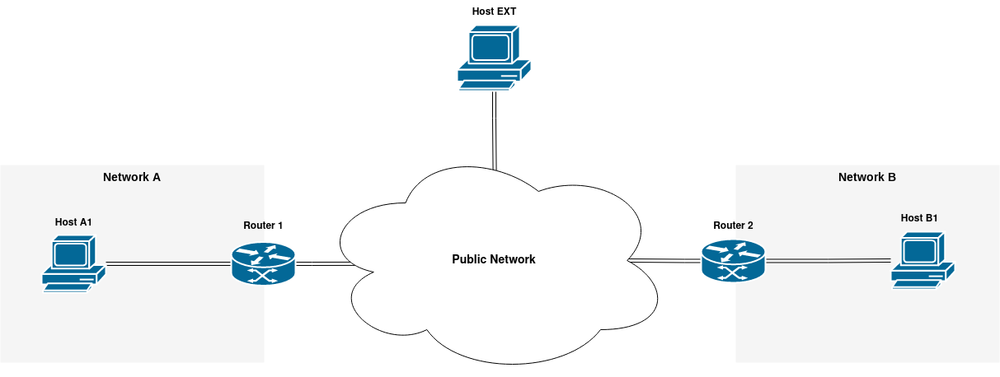

# TP VPN/IPsec
Au cours de ce TP, vous allez interconnecter deux réseaux avec différentes solutions VPN. Vous allez commencer par la mise en place d’un tunnel non sécurisé avec **GRE**. Ensuite, vous le protégerez avec **IPsec** en gérant les clés de chiffrement et d’authentification manuellement. Puis, vous allez configurer un tunnel **IPsec** avec **IKE** en utilisant **strongSwan**. Vous configurerez également un **OpenVPN** avec une autorité de certification et des certificats. Si vous avez suffisamment de temps, vous mettrez également en place un VPN **Wireguard**.

## Rendu: 
Afin d'être évalué, vous devez rédiger un rapport dans lequel vous placez toutes les commandes exécutées sur toutes les machines, tous les fichiers de configuration créés et les réponses aux questions.

## 1 - Creation de l’infrastructure
Afin de pouvoir réaliser ce TP, vous allez commencer par créer l'infrastructure nécessaire. L’ensemble du TP se fera sur la plateforme OpenStack de l'université. 

### L'architecture de déploiement


Chaque routeur et chaque host seront des VMs sur Openstack. Les réseaux privés A et B seront des réseaux OpenStack. Le réseau par défaut (***vlanXXXX***) jouera le rôle du réseau public.

Créez les éléments suivants :
- Une clé SSH qui sera utilisée uniquement pour ce TP
- 2 réseaux sur OpenStack
    - 1 réseau pour le **Network A** avec le sous réseau ***172.18.{Numéro de groupe}.0/24***. Nommez le réseau ***network-a-{numéro de groupe}***
    - 1 réseau pour le **Network B** avec le sous réseau ***172.19.{Numéro de groupe}.0/24***. Nommez le réseau ***network-b-{numéro de groupe}***
- 5 machines virtuelles avec 1 vCPU, 2 GB de RAM, l’image Ubuntu 22.04, les interfaces réseau qui font partie des réseaux respectant l'architecture de déploiement et la clé SSH créée précédemment. Nommez les machines en suivant la même logique que pour les réseaux.

**Désactivez dans l’OpenStack la sécurité des ports sur tous les ports des réseaux A et B.**
- *Network -> Networks -> {Nom du réseau} -> Ports -> Edit Port -> Décochez Port Security*
- Si vous ne faites pas cela, Openstack bloquera tout le trafic avec des adresses IP qui ne sont pas incluses dans les sous-réseaux précédemment configurés.

**Configurez le Router 1 et le Router 2 comme passerelles par défaut sur les hôtes des deux réseaux.**
- Pour vous connecter aux hôtes, mettez la clé privée SSH précédemment créée sur le Router 1 et le Router 2 et connectez-vous aux hôtes en passant par les routeurs.

**Activez le routage et configurez NAT sur les deux routeurs afin que les hôtes des deux réseaux puissent communiquer avec l'extérieur.**

**Vérifiez que les hôtes des deux réseaux peuvent communiquer avec l'extérieur, mais ne peuvent pas communiquer entre eux.**

## 2 - Tunnel GRE
**Configurez un tunnel GRE entre Router 1 et Router 2.**
- Vous pouvez vous inspirer du tutoriel suivant : 
    - https://www.xmodulo.com/create-gre-tunnel-linux.html

**Mettez à jour les règles de routage afin que les machines du réseau A puissent communiquer avec les machines du réseau B.**

**Visualisez avec Wireshark via SSH les paquets échangés entre le Router 1 et le Router 2. Que pouvez-vous conclure?**
- Vous pouvez utiliser le Wireshark via SSH avec la commande suivante:
    ```bash
    ssh ubuntu@ADRESSE_IP_DU_ROUTEUR "sudo tcpdump -s0 -U -n -w - -i enp2s0 'not port 22'" | wireshark -i -
    ```

## 3 - IPsec - Gestion des clés manuelle
**Mettez en place l’IPsec entre le Router 1 et le Router 2 en mode transport et avec le mécanisme de sécurité ESP.**
- Utilisez le framework IP XFRM pour configurer l’IPsec
- Générez et configurez les clés manuellement
- Vous pouvez vous inspirer de la page suivante:
    - https://serverfault.com/questions/995091/ipsec-tunnel-between-2-remote-host

**Expliquez la différence entre un *state* et un *policy*.**

**Visualisez avec Wireshark via SSH les paquets échangés entre le Router 1 et le Router 2. Que pouvez-vous conclure?**

**Vérifiez que les machines du réseau A puissent communiquer avec les machines du réseau B.**

## 4 - IPsec - IKE avec strongSwan
La configuration manuelle des clés de chiffrement convient à des fins de démonstration, mais dans la vie réelle, la gestion et la configuration des clés se font de manière automatisée avec un démon IKE. Dans cette section, vous allez déployer un **VPN IPsec avec IKE** en utilisant **strongSwan**.

**Supprimez le tunnel GRE et l’IPSec entre les routeurs 1 et 2.**

**Configurez IPsec en mode tunnel entre Router 1 et 2 avec strongSwan.** 
- Avec IKEv2 comme mécanisme d'échange des clés et le Pre-shared key (PSK) pour l’authentification
- Vous pouvez vous inspirer du tutoriel suivant
    - https://www.tecmint.com/setup-ipsec-vpn-with-strongswan-on-debian-ubuntu/

**Vérifiez que les hôtes des deux réseaux puissent se parler.**
- Étant donné qu'IPsec est en mode tunnel, NAT doit être désactivé sur les routeurs 1 et 2 afin que les hôtes des deux réseaux puissent communiquer entre eux.
- Pourquoi y a-t-il des problèmes avec le NAT dans cette configuration ?

**Vérifiez la sécurité des paquets échangés entre les routeurs avec Wireshark.**

## 5 - OpenVPN
Dans cette section, vous allez configurer un **OpenVPN** avec une autorité de certification et des certificats.

**Supprimez IPSec strongSwan entre les routeurs 1 et 2.**
- Pour ce faire, restaurez le contenu du fichier ***/etc/ipsec.conf*** depuis ***/etc/ipsec.conf.orig*** et redémarrez ***ipsec***. Si vous n'avez pas enregistré la configuration IPsec par défaut, supprimez le fichier ***/etc/ipsec.conf*** et redémarrez ***ipsec***.

**Configurez le serveur OpenVPN sur le Routeur 1**
- Le serveur doit être configuré en **mode TUN** et doit utiliser le protocole **UDP**
- Commencez par créer l'autorité de certification sur le Routeur 1, vous pouvez vous inspirer du tutoriel suivant (Jusqu'à l'étape 3) :
    - https://www.digitalocean.com/community/tutorials/how-to-set-up-and-configure-a-certificate-authority-ca-on-ubuntu-20-04
- Pour la configuration de la partie serveur, vous pouvez vous inspirer du tutoriel suivant :
    - https://www.digitalocean.com/community/tutorials/how-to-set-up-and-configure-an-openvpn-server-on-ubuntu-20-04
    - Si vous utilisez ce tutoriel, ne changez pas l'utilisateur et le groupe du serveur OpenVPN
- Générez les clés et les certificats pour deux clients

**Configurez le serveur OpenVPN pour qu’il annonce la route du réseau A sur chaque client.**
- Pour cela, vous devez configurer une ***push "route"*** dans **server.conf**

**Configurez le Router 2 et le Host EXT comme clients OpenVPN**
- Mettez **ta.key**, les clés et les certificats des clients sur le Router 2 et le Host EXT
- Configurez les clients en mode démon. Vous pouvez vous inspirer de la partie "Configuration client simple" de ce tutoriel :
    - https://guide.ubuntu-fr.org/server/openvpn.html
- Dans la configuration du client mettez la même configuration d'encryption et d'authentification que sur le serveur
    ```
    cipher AES-256-GCM
    auth SHA256
    ```

**Vérifiez si le Router 2 et Host EXT sont capables de communiquer avec les hôtes du réseau A.**

**Configurez le serveur OpenVPN pour que le réseau B soit accessible par tous les clients OpenVPN via le Routeur 2.**
- Vous pouvez vous inspirer de la section “Including multiple machines on the client side when using a routed VPN (dev tun)” de ce tutoriel: 
    - https://openvpn.net/community-resources/how-to/

**Vérifiez si le Router 1 et le Host EXT sont capables de communiquer avec les hôtes du réseau B.**

**Vérifiez si les hôtes des deux réseaux peuvent communiquer via le tunnel OpenVPN.**

**Vérifiez que l'échange entre le Router 1 et le Router 2 est bien sécurisé.**

## 6 - BONUS - WireGuard
Dans cette section, vous allez mettre en place un VPN Wireguard entre les routeurs 1 et 2.

**Supprimez le VPN OpenVPN.**

**Configurez un VPN Wireguard entre deux routeurs**
- Vous pouvez-vous inspirez de la documentation officielle de WireGuard https://www.wireguard.com/#conceptual-overview et de l’article https://www.ericlight.com/wireguard-part-one-installation.html

**Vérifiez si les hôtes des deux réseaux peuvent communiquer via VPN WireGuard.**

**Vérifiez que l'échange entre le Router 1 et le Router 2 est bien sécurisé.**

Bravo! Vous avez terminé le TP!
